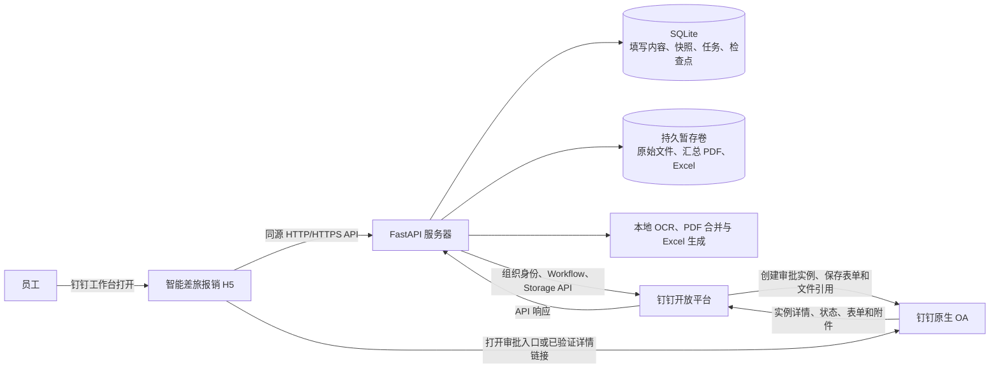
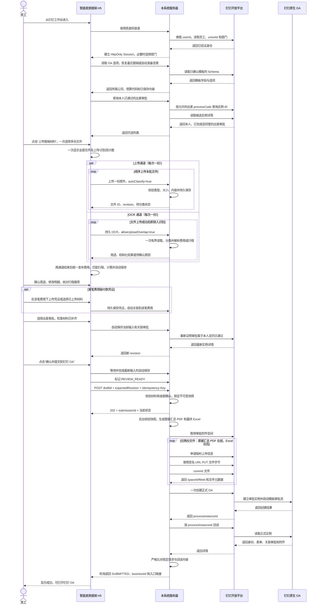
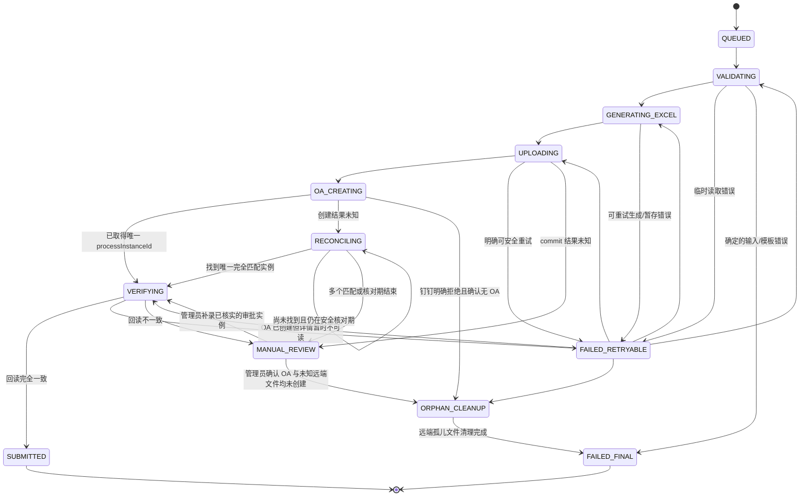

# 钉钉 OA 差旅报销集成设计

文档状态：与当前实现对齐，生产验收前基线；数据库迁移基线：`20260914_0018`；适用技术栈：Vue 3 + TypeScript、FastAPI、SQLite、钉钉企业内部应用。

## 1. 要实现的结果

员工从钉钉工作台打开“智能差旅报销”，在一个页面内完成以下事情：

1. 选择本人已通过的出差审批，由服务器带入所属公司和预算代码，只读展示；预算代码的完整标签就是 Excel 内的项目，相同公司、预算和出差类别的审批可多选；
2. 使用“上传报销材料”一次选择发票、车票、打车行程单、住宿明细和付款凭证，由系统识别用途，不确定的材料由员工确认；
3. 在同一份费用列表内检查、修改和预览票据，核对行程推荐，按费用补齐住宿明细和付款凭证；国外票据另行确认人民币报销金额；
4. 按需申请出差补助；境外出差也按管理员设置的每日标准自动计算，默认标准为 0 元/天；
5. 点击一次“确认并提交到钉钉 OA”。

页面自动保存尚未填完的内容，重新打开时恢复最近一笔报销或它的提交结果。员工只需填写和最终确认；提交成功后可点击“再报销一笔”。

点击确认后，服务器先保存最新填写内容，再锁定数据、重新计算金额，生成最终报销 Excel，并把发票、行程单等材料合成 `票据汇总.pdf`。服务器将这两个文件上传到钉钉审批附件空间，一次性创建正式的“差旅费报销申请”。出差审批写入关联审批控件；同一个附件控件中只有“票据汇总 PDF + 报销单 Excel”两份文件，便于下载打印。

员工不需要下载 Excel，也不需要再手工选择 Excel 上传。Windows、macOS、Android 和 iOS 使用的都是同一套 H5 流程；设备只负责第一次选择本机文件，后续生成、上传和发起 OA 都由服务器完成。

系统范围到“正式发起 OA 并回读确认表单、关联审批和附件正确”为止。审批流转、财务审核、人工打款以及打款后的业务记录继续由钉钉和财务人员处理。

## 2. 关键名词

| 名词 | 简单解释 |
|---|---|
| 本次报销内容 | 系统自动保存的填写内容；服务端为兼容已有接口仍使用 `draftId` 和 `reimbursement_drafts` 命名 |
| 报销 Excel | 本系统根据员工最终确认的数据生成的 `.xlsx` 文件 |
| 票据汇总 PDF | 根据原始票据、关联行程单和其他材料合成的打印文件；页面内容来自原件，不是 OCR 重排文字 |
| 材料用途 | 文件是费用来源、打车行程单、住宿明细、付款凭证还是其他材料；系统分类后允许员工修正，用途不确定时明确提示 |
| 行程单关联 | 某一笔费用保存对应材料的文件 ID；一个文件可包含多次行程，关联可以自动匹配或由员工确认，与钉钉“关联出差审批”是两个独立关系 |
| `processCode` | 一类钉钉审批模板的标识，例如“差旅费报销申请”模板的标识 |
| `processInstanceId` | 某一张已经发起的具体审批单的唯一标识 |
| Schema | 钉钉审批模板的字段说明，包括字段 ID、类型和选项 |
| 模板指纹 | 对 Schema 计算的 SHA-256；模板字段变化时，指纹也会变化 |
| 关联审批 | 钉钉 `RelateField` 控件，保存出差审批的 `processInstanceId`，可在 OA 中打开原审批 |
| 审批附件 | 钉钉 `DDAttachment` 控件里的文件引用 |
| 审批附件空间 | 钉钉给审批附件提供的专用存储空间，由服务器取得并上传文件 |
| commit | 文件字节上传后，通知钉钉把它登记成正式文件并返回 `spaceId/fileId` |
| 幂等 | 同一次提交即使重复点击、刷新或网络重试，也只能创建一张 OA |
| 快照 | 员工确认时冻结的一整套数据，后台后续只能按它生成 Excel 和 OA |
| CAS | 更新时同时检查版本号；如果别人已改过数据，本次更新拒绝，避免互相覆盖 |
| 租约 | 后台任务暂时取得的处理权；进程崩溃后租约过期，另一个任务可安全接手 |
| 孤儿附件 | 已经在钉钉完成 commit，但确定没有任何 OA 引用的文件 |
| 人工核对 | 系统无法安全判断远端是否已产生文件或 OA 时停止自动操作，由管理员确认 |

## 3. 总体架构



这里有两份不同位置的文件：

- 服务器持久暂存卷保存员工上传的原件和生成的 PDF、Excel，用于预览和重启恢复；
- 钉钉审批附件空间保存完成 commit 的汇总 PDF、Excel，OA 表单通过 `spaceId/fileId` 引用这两份文件。

钉钉公开接口没有给这类审批空间一个可以可靠对外展示的“个人盘”或“公司盘”名称。产品页面只称它为“审批附件空间”，也不要求员工进入钉盘操作。

## 4. 完整时序



## 5. 客户端和服务器的分工

### 5.1 H5 客户端

H5 负责员工看得见的交互：

- 钉钉免登和多部门选择；
- 自动准备和恢复本次报销，自动保存未完成的输入并显示保存状态；
- 只读展示服务器从已通过出差审批解析的所属公司、预算代码，用当前报销模板的预算标签填 Excel 项目；
- 提供统一材料上传入口，先显示整批文件，让单文件上传与单文件分类识别重叠执行；显示待确认用途并允许手工修正；
- 在单一费用列表展示 OCR 候选、来源票据、关联行程单及编辑/删除操作；识别失败、中断或没有可用结果时额外提供重新识别，允许手工增加费用行；
- 展示行程单金额、日期、次数、路线和关联状态，默认选择一个文件，按需补充；交通类型不明确时由员工确认保守推荐；
- 在缺住宿明细或付款凭证的费用下提供上传及已上传材料复用入口，底部列出材料待办并定位；展示国外票据原币信息并要求确认人民币报销金额；
- 查询并选择本人已通过的出差审批；
- 通过鉴权接口预览已上传文件；图片直接显示，PDF 由前端在当前页面逐页渲染；下载当前内容的 Excel 预览；
- 在正式提交前给出不可撤销提示；
- 展示后台进度、最终 OA 编号和打开入口。

H5 不取得企业 access token，不保存 `Client Secret`，不调用钉钉服务端文件上传接口，也不负责把生成的 Excel 再上传一次。

### 5.2 FastAPI 服务器

服务器负责可信数据和全部远端写操作：

- 缓存企业 access token；
- 把免登码换成当前员工身份，并把 `userId`、`unionId`、企业和部门绑定到 Session；
- 保存模板目录、字段映射、Schema 指纹和配置版本；
- 查询、复核并冻结关联出差审批，从原审批解析公司和预算，并验证多选的一致性；
- 安全接收并持久保存原始文件，用一次有界本地读取完成材料分类和结构化解析，持久保存未确定用途及失败状态；
- 后端重新计算补助、总额、票据数和人民币大写；
- 校验用途已确定、费用与行程单/住宿明细/付款凭证文件关系、每笔住宿的住宿明细文件、付款凭证门槛、必填字段和人民币金额确认；
- 根据锁定快照生成最终 Excel 和票据汇总 PDF；
- 申请上传信息、PUT、commit、创建 OA 和回读 OA；
- 保存幂等记录、状态、租约和每一个危险远端操作前的检查点；
- 自动重试安全操作，处理确定的孤儿文件，对不确定结果停止自动写操作；
- 按文件生命周期删除服务器本地副本。

## 6. 模板目录和后续换 `processCode`

### 6.1 管理员配置流程

模板配置不是写死在前端，也不是只替换一个字符串。管理员使用模板目录接口完成下面的流程：

1. 输入报销模板 `processCode` 和一个或多个允许关联的出差模板；
2. 调用检查接口，从钉钉读取每个模板最新 Schema；
3. 把报销模板的 10 个业务字段映射到真实控件 ID；
4. 把每个出差模板的开始日期、结束日期映射到两个 `yyyy-MM-dd` `DDDateField`，或同时映射到同一个 `TableField/DDTableField` 行程明细控件；同时把 `company`、`budgetCode` 映射到来源模板的所属公司、预算代码控件，支持 `DDSelectField` 或 `TextField`；
5. 为每个出差模板选择它对应的报销“出差类别”精确选项；
6. 确认关联审批控件允许这些出差模板；
7. 使用 Schema 指纹和 `expectedConfigVersion` 保存配置。

保存时服务器会再次读取 Schema。只要字段名称不同但业务含义和控件类型仍符合下表，就能通过重新映射适配，通常不需要改代码。若新模板缺少业务字段、控件类型不兼容、把字段移入不支持的复杂容器，或增加了必须由系统填写的新业务含义，才需要修改适配代码。

### 6.2 报销模板固定业务字段

| 逻辑键 | 页面含义 | 允许的钉钉控件类型 | 值的来源 |
|---|---|---|---|
| `company` | 所属公司 | `DDSelectField` | 当前 Schema 中的精确选项 |
| `budgetCode` | 预算代码 | `DDSelectField` | 当前 Schema 中的精确选项 |
| `travelType` | 出差类别 | `DDSelectField` | 关联出差模板对应的精确选项 |
| `startDate` | 开始日期 | `DDDateField` | 所有关联出差审批的最早日期 |
| `endDate` | 结束日期 | `DDDateField` | 所有关联出差审批的最晚日期 |
| `durationDays` | 时长（天） | `NumberField` | 最早开始到最晚结束的总自然日跨度（含中间空档） |
| `description` | 明细说明 | `TextField` 或 `TextareaField` | 费用行、补助和合计的服务器格式化结果 |
| `reimbursementAmount` | 报销金额 | `MoneyField` 或 `NumberField` | 服务器计算总额 |
| `relatedApprovals` | 关联审批单 | `RelateField` | 已复核的出差 `processInstanceId` 数组 |
| `attachments` | 附件 | `DDAttachment` | 票据汇总 PDF、最终 Excel 的远端文件元数据 |

前端只读展示服务器解析后的所属公司和预算代码。来源是已通过的出差审批，目标值必须唯一对应当前报销模板 Schema 中的精确选项，不能写死企业选项或控件 ID。

`budgetCodeValue` 保存解析后的精确选项值，服务器从当前绑定 Schema 取得对应完整标签，作为 Excel 的项目文字。所属公司、预算代码和项目由保存关联审批的操作原子更新，普通草稿创建或自动保存不能覆盖这些值。完整标签可达 2048 字符，Excel 项目栏按内容扩展；文件名中的项目部分单独限长。

升级配置时，管理员先 inspect 各出差模板，检查两个来源字段并确认映射。未显式配置时，仅允许在同一来源 Schema 中回退到标签精确等于“所属公司”或“预算代码”、类型受支持且唯一可用的控件；缺失、重名、隐藏或禁用字段会使候选不可选择并显示原因。选项先在来源模板内唯一解析，再用值或完整标签唯一匹配报销模板选项；跨模板不复用选项 key，也不作模糊匹配。此功能复用已有审批模板、列表和详情接口，不增加钉钉权限。

### 6.3 模板变更保护

`oa_template_profiles` 保存配置版本、完整 Schema、字段映射、确认指纹、允许的出差模板和确认人。草稿创建时绑定当时的 `processCode + configVersion + schemaFingerprint`。

正式提交前后台还会重新读取报销模板和所用出差模板。指纹变化时，系统在上传任何钉钉文件之前终止这次提交，要求管理员重新检查映射，避免把金额或附件写进错误字段。已绑定旧配置的可编辑草稿不会静默改成新模板。

管理员已确认新模板后，若本次填写内容尚未锁定、也没有正在跟踪的提交，但绑定的 `processCode/configVersion/schemaFingerprint` 与当前配置不同，页面提供“按新表单重新填写”。员工明确确认后准备一笔绑定新配置的空白报销；原记录和已上传材料保留，员工重新填写及上传，避免把未经适配的数据直接带入新表单。

管理员接口见 [OA 模板目录 API](../backend/app/api/oa_templates.py)，字段契约见 [模板适配服务](../backend/app/services/oa_template_profiles.py)。

## 7. 查询和关联出差审批

### 7.1 候选审批

服务器只使用 Session 中的当前 `userId`，不接受前端指定其他员工。默认查询上海时区最近 180 个自然日；自定义起止日期必须同时填写，范围不能超过 180 天。由于钉钉单次实例列表接口最多查询 120 天，服务端会自动拆分为不超过 120 天的连续区间，并合并查询结果。

每个已配置的出差模板都按下面条件查询和回读：

```text
processCode 属于管理员确认的出差模板
AND userIds 只有当前员工
AND status == COMPLETED
AND 实例 originatorUserId == 当前员工
AND 实例 result == agree
AND 开始、结束日期能从已映射控件准确读取
```

顶层日期控件按 `yyyy-MM-dd` 严格读取。原生行程明细按每行 `rowValue` 中的 `bizAlias=startTime/endTime` 严格解析，多段行程取全部有效行的最早开始日期和最晚结束日期；表格 JSON、行结构、字段别名或日期值不符合约定时，整张审批不进入候选列表。

一页最多取 20 个 ID；整个查询最多接受 200 个候选，详情并发上限为 5。超出时要求员工缩小日期范围。关键词只匹配审批标题或审批编号。

### 7.2 保存选择时再次证明

前端提交的每个选择只包含：

```json
{
  "processInstanceId": "实例ID",
  "profileKey": "管理员配置的出差模板键",
  "queryWindow": {"from": "2026-08-01", "to": "2026-09-01"}
}
```

服务器会用原查询窗口重新查询实例 ID，再读取详情，证明这张审批仍在当前员工可选列表中。服务器保存标题、业务编号、出差日期、来源模板、Schema 指纹、查询窗口和复核时间，并解析当前公司与预算。多张审批必须同时满足所属公司、预算代码和报销“出差类别”一致，日期允许不连续。不连续区间分别计算补助，直接或链式重叠的审批在计算与 Excel 明细阶段合并，避免重叠日期重复补助。

申请补助时，每张关联审批对应一个日期完全一致的原始补助项；不连续时段的空档不计算补助，重叠时段合并后只补助一次。没有申请补助时，为兼容发票开具日期与实际发生日期的合理偏差，只要求关联审批总区间与费用日期范围存在交集。服务端在复核和正式提交快照时执行相同规则。

清空全部关联审批时，服务器同时清空公司、预算和项目，保留已上传文件、手工费用及补助行程。恢复已有可编辑草稿时，服务器管理的 `accountingSourceVerified` 标识决定关联来源是否已核实；未核实记录须通过页面重新确认现有审批后再复核提交，客户端不能自行设为已核实。

正式提交阶段再做一次同样的远端复核，防止员工保存草稿后原审批被撤销或模板发生变化。

### 7.3 写入 `RelateField`

写给钉钉的是具体实例 ID 数组的 JSON 字符串：

```json
{
  "name": "关联审批单",
  "value": "[\"instance-id-1\",\"instance-id-2\"]",
  "id": "从已确认 Schema 取得的控件ID",
  "componentType": "RelateField"
}
```

这里不能使用审批编号 `businessId`，也不能使用模板的 `processCode`。

## 8. 自动保存、票据明细和生成文件

### 8.1 自动保存和恢复

填写内容持久保存在 SQLite，按企业、员工和所选部门隔离。页面进入时自动准备空白报销或恢复最近记录；已提交的记录恢复进度或成功结果，避免刷新产生新审批。员工编辑后约 600 毫秒触发自动保存，表单、文件用途和关联等业务修改串行使用最新 `expectedRevision`。统一上传批次仅允许“上传下一份文件”和“首次识别已上传文件”两条受控通道重叠：上传仍按整份报销版本写入，首次 OCR 按文件状态及输入指纹保护，不推进整份报销版本；处理期间暂停表单修改和自动保存，避免相互覆盖。

尚未关联出差审批、公司和预算尚未带入、费用缺少日期/金额、补助日期时间尚未填完时也允许保存。`editingState` 保存未完成的输入文字；计算只使用完整费用行，Excel 预览和正式提交则要求所需字段完整。保存失败时页面保留当前输入并显示原因，不能把仍在本页的修改显示成已持久保存。提交会等待最新内容保存完成后再锁定。

每次修改都必须带 `expectedRevision`。不同页面写入导致版本冲突时重新读取服务器状态，不盲目重放写请求。`draftId` 只是后台定位本次填写内容的标识；页面提供“正在保存 / 已保存 / 保存失败”和成功后的“再报销一笔”。

提交明确终止为 `FAILED_FINAL` 时，可点击“重新填写”开始一笔空白报销，失败记录和审计历史继续保留。处理中或结果不确定的提交继续跟踪原任务，不能通过这个入口重建审批。

内部状态：

```text
DRAFT --检查完整性--> REVIEW_READY --正式提交原子锁定--> LOCKED
  ^                            |
  |--------再次修改------------|

DRAFT / REVIEW_READY --超过 expiresAt--> EXPIRED
```

`REVIEW_READY` 只是“内容已检查，可以提交”，仍不是钉钉 OA。任何修改会增加 revision 并回到 `DRAFT`。创建提交记录时，草稿、提交快照和原始附件清单在一个数据库事务中写入，草稿同时变成 `LOCKED`。

### 8.2 文件角色、预览和保存位置

员工使用一个“上传报销材料”按钮选择文件。统一入口以 `role=ATTACHMENT_ONLY&attachmentKind=other&autoClassify=true` 安全暂存，服务器保存 `pending` 分类状态；识别完成后按内容转换为下面的处理角色。按某笔费用“添加付款凭证”或“添加住宿明细”时用途已明确，直接按对应用途上传并关联。

- `EXPENSE_SOURCE`：发票、车票等需要 OCR 的票据；
- `ATTACHMENT_ONLY`：证明材料，持久用途 `attachmentKind` 为 `itinerary`（行程单）、`hotel_bill`（住宿明细）、`payment_proof`（付款凭证）或 `other`（普通材料，默认值）；用途和处理角色是两个字段。`EXPENSE_SOURCE` 只允许 `other`，证明要求必须由对应的材料用途满足。

当前持久文件允许 `jpg/jpeg/png/pdf`，单文件默认上限 20 MiB。统一入口和 `ATTACHMENT_ONLY` 的 PDF 最多 30 页，每页都执行安全检查；`EXPENSE_SOURCE` 保持独立单页票据，多页/混合票据不能直接产生一条费用。人工改为费用来源时重新执行单页检查，要求拆分的文件明确提示员工。前端允许一次选择多份，但逐份调用上传接口；服务器先做扩展名、magic bytes、图片或 PDF 内容检查，再把文件放入受控持久暂存卷。存储路径只使用服务器生成的 UUID，不使用原文件名作为路径。

材料分类依据标题、发票特征、行程表格及支付字段的组合，不以文件名或单个“行程单”关键词决定用途。例如“航空运输电子客票行程单”是费用来源，备注提及行程单的发票不能因此变成打车证明。付款成功提示结合金额/交易字段才可识别为付款凭证；混合内容、读取不完整或证据不足标为“待确认用途”，可重试或选择发票、行程单、付款凭证、其他材料。相关票面事实见[官方资料研究笔记](research/PASSENGER_INVOICE_FIELDS_AND_MULTI_TRIP_RESEARCH.md)。

`materialClassification` 保存 `pending/classified/needs_confirmation/confirmed` 状态和 `expense/itinerary/hotel_bill/payment_proof/other/unknown` 分类。首次分类处理中、失败或待确认的文件保留在列表中，刷新后继续显示；用途未确定时不产生费用、不用于满足证明要求，服务端阻止复核和正式提交。只有 `pending/needs_confirmation` 的重试重新自动分类；已经 `classified/confirmed` 的费用来源、行程单和住宿明细可按既定用途重新识别，成功、失败、取消或版本冲突均不自行改变用途或移除员工费用/关联。前端只在识别失败、中断、不完整到无法作为有效证据或没有可用结果时显示这一恢复入口；正常完成的结果通过编辑修正。普通材料和付款凭证确定用途后不再提供 OCR。员工显式修改角色/用途后记为 `confirmed`；确认其他材料可以解除用途待办，但不能替代必需证明。

费用来源、已关联证明及未关联材料都提供“修改用途”。同值确认只确认用途，不额外启动 OCR，也不覆盖人工费用字段。来源发票实际改成证明材料时，先明确提示“保留原文件、移除对应费用”，员工确认后才修改角色并清理失效引用；修改用途不等于删除原文件。

数据库保存大小和 SHA-256。后续预览、OCR、生成快照和汇总材料每次都按这两个值重新核对文件，避免磁盘内容被替换。刷新后的预览通过 `GET /api/reimbursements/drafts/{draftId}/files/{fileId}/content` 重新取得内容；接口校验企业、员工、部门、文件状态和有效期，响应禁止缓存。前端使用 Blob 展示图片/PDF，关闭预览时释放对象 URL。

分类元数据复用 `ocr_result_json._materialClassification` 持久化，对外以独立 `materialClassification` 字段返回。删除、改角色或改用途复用 revision/锁定保护，并原子清理失效的来源、行程单、住宿明细和付款凭证引用；只改文件名不确认用途。

### 8.3 OCR 和费用明细

统一上传、费用来源和行程单都复用持久 OCR 接口。统一上传在一次有界读取中完成分类和对应解析，复用提取文字；付款凭证可提取金额、日期和摘要供手工录入参考，不自动生成费用。人工明确上传的付款凭证和其他材料直接保存。服务器保存页面需要的结构化候选及 `NOT_REQUESTED/RUNNING/COMPLETE/FAILED` 状态。每条由 OCR 产生的费用行都通过 `sourceFileId` 保存来源文件 ID，不用金额、日期或说明文字反推关系。重新识别更新同一条候选，不重复增加明细；员工已经手工修改的费用行不会被迟到的 OCR 响应覆盖。

统一分类入口与单独票据识别共享 PDF 字段完整性判断：数字文本缺金额、日期或交通路线等必要信息时，在同一有界 worker 内补一次图片 OCR，并保留数字文本中已有的互补证据；外币票据仅因缺原币金额触发此补读，不因人民币金额为空反复识别。补读失败时保留已有数字票据候选供核对。本地二维码金额证据也沿用原解析规则及人工核对警告，不作为已验真或无须核对的结论。

一份独立来源文件对应一张票据。费用的 `sourceFileId` 非空时，后端将 `receiptCount` 规范为 `1`；无来源的手工汇总仍可调整张数，材料附件不计张数。当前快照拒绝来源票据张数不为 1。

多选批次先显示固定的全部文件占位，同时展示“已上传 X/N、已识别 Y/N”。上传和 OCR 各有一条顺序通道：A 上传完成即开始识别，同时上传 B；每个浏览器批次的 OCR 通道最多一个请求在途，服务端仍只有一个 OCR 执行槽，并用有界 FIFO 队列按所有用户的请求到达顺序准入。两条通道都结束后才统一发布费用候选、匹配行程、重算并自动保存，避免列表逐张重排和重复计算。服务端已持久返回失败的识别结果仍作为批次失败显示，不会因为 HTTP 请求成功而误报“处理完成”。明确用途的单独材料上传及已识别文件的重试沿用普通串行操作。

单份失败保留该行原因并继续后续文件，不自动重放请求。尚未到达服务器的上传失败项就地提供“重试上传”和“移除”：重试只重放该文件并沿用原用途，不重复上传本批其他文件；移除只清除本地失败项。已经上传但 OCR 失败的文件继续在材料列表提供“重新识别”和删除。上传失败后只读取最新报销版本供下一次上传使用；有失败的批次在两条通道均停止后统一回读输入和文件，再发布可用结果。前端版本号只增不减，OCR 的迟到回包只能更新对应文件，不能用旧清单覆盖其他新上传文件。整批处理期间禁止修改明细、删除、清空和复核/提交；切换报销、部门或卸载组件会取消本批请求并忽略迟到结果。若发现报销输入已被外部修改，则停止本批并提示重新载入，不把旧费用发布到新上下文。行程单识别只更新文件证据，不产生费用行或重新累计票面金额。

费用列表集中呈现票据、费用字段、关联行程单和操作；上传中、识别失败或尚未计入费用的材料也在同一区域展示。每份已完成或识别失败的 `EXPENSE_SOURCE` 在正式提交前必须明确二选一：关联到一条费用明细，或由员工明确选择仅作为材料保留。删除费用行和删除文件保持明确语义；附件删除会同步清理对应来源或行程单引用，缺少必要行程单的费用重新进入待补齐状态。

短暂的文件操作状态通过固定最小宽度的上传按钮加载动画、悬停说明及屏幕阅读器状态提示呈现，不动态增加头部提示行，避免删除确认、重识别等操作使费用区域上下跳动。附件上限、报销锁定等持续性限制仍有可见说明。

头部“清空文件”用于误传后的批量重来：仅对当前未锁定报销的已上传文件生效，二次确认明确文件数量、随之移除的来源费用数量和不可撤销影响。前端一次调用 `POST /api/reimbursements/drafts/{draft_id}/files/clear`，携带 `expectedRevision`；后端统一校验权限、版本、上传/识别占用和提交引用，在一个事务内移除全部来源费用及行程单/付款凭证引用，将目标标记为 `DELETING`，只递增一次报销版本。保留手工费用、基本信息、补助和出差审批关联。物理文件校验与删除最多两路并行，真正删除后才释放存储占用，全部完成后页面一次刷新。处理中禁止重复清空及提交；取消确认不发送请求，已确认的服务器删除即使客户端离开也继续完成，迟到响应不污染新报销。部分物理删除失败时回读服务器状态，保留 `DELETING` 文件供再次清空或现有清理任务重试，不恢复已解除的费用关联；不会删除整个报销记录或其他报销文件。本版仍等待物理清理完成才返回成功，不引入新的后台清空任务系统。

输入使用 `ocrDispositionVersion=1`，每个活动的终态 `EXPENSE_SOURCE` 在费用行 `sourceFileId` 或 `dismissedOcrFileIds` 中恰好出现一处。自动保存允许尚未决定的材料，完整性检查和正式提交会阻止静默漏报；网络丢失 OCR 回包后可按文件 ID 恢复候选，不重复增加金额。

### 8.4 打车费用、行程选择和匹配

- `transportType=taxi/ride_hailing` 显示行程单关联入口。费用行通过 `itineraryFileIds` 保存活动的 `ATTACHMENT_ONLY + attachmentKind=itinerary` 文件，编辑窗口默认选择一个文件，需要时展开“补充行程单文件”；已有多文件关系继续完整显示和保存。
- `requiresItinerary=true` 或 `transportType=ride_hailing` 的费用必须关联至少一份行程单；前端提示缺失位置，后端复核和正式提交再次检查。
- 后端结合来源票据的实际 OCR 类型和标记判断要求，前端把开关改成 `false` 不能绕过。纸质出租车小票、火车票、住宿票据按对应类型处理。
- 同一份多行程 PDF 可由多笔费用分别选择。自动匹配只使用完整、无警告且唯一的行程单结果：优先同类发票号或订单号，其次人民币金额、发生日期和有方向的起终点同时一致；相同类型的号码明确矛盾、反向/重叠路线、重复候选或部分识别一律交人工。文件名不作为证据，已有手工关联不覆盖。自动关联是填写辅助，不证明每个订单或金额都真实一一对应。
- 来源票据交通类型未确定或为其他时，不仅凭“电子发票＋起终点”改成网约车。满足保守证据要求且双方唯一时给出“疑似对应”推荐，员工确认后才设置打车类型和行程关联；点击时重新检查当前证据，保留既有手工关联和禁用自动匹配的意图。
- 市内交通电子发票缺少乘车日期或路线时，允许按人民币金额给出弱推荐：发票金额与完整行程文件的合计及全部明细加总一致，双方金额候选唯一，号码不矛盾，且行程尚未占用。单行程推荐展示日期、路线；多行程汇总推荐展示整份合计、行程笔数及日期范围。两者都提供文件预览和“确认关联 / 选择其他”按钮，只在员工点击确认后绑定。多行程确认仅关联整份文件，不以第一笔行程覆盖费用日期或说明。多个同金额候选、金额识别存疑交人工选择，不升级为自动关联。
- 多页行程单的续表可以继承同一文件内明确且无歧义的行程日期范围，解析省略年份的日期；不使用当前年份或申请日期猜测。无可用范围、跨年歧义或明细加总不一致时保留待人工核对提示。完整的原生文字续表不额外调用图片 OCR。
- 推荐卡说明确认后将补全哪些字段：仍为空的日期、未修改的开票日期占位、空说明或原费用类别占位，可用已确认行程补全；已修改的日期和说明保持原值，报销金额与原 OCR 证据不变。只移除本次已补齐字段的缺失提示；已有推荐时不重复展示“待补行程单”卡片，其他缺材料提示保留。该操作沿用当前费用的自动保存机制，不新增识别或上传请求。
- 关联文件必须属于同一笔报销，且仍为活动行程单材料；删除、改变角色或用途后关联失效，补齐后才能提交。

下拉选项展示文件合计金额/币种、日期或日期范围、行程次数、路线、文件名及已关联费用数量，并支持按金额、日期、路线和文件名搜索，唯一推荐项置前。多行程文件标明“合计”和“多行程”；推荐具体行程时另列该次金额、日期、路线，避免把整份文件总额与单次费用混淆。文件级多对多关系用于组织材料，不表示任意多选组合都已完成金额核对。

费用 JSON 使用严格布尔 `itineraryAutoMatchDisabled`（默认 `false`）保存编辑意图。员工手工改变或清空关联时设为 `true`，普通保存/恢复和刷新后继续禁止自动覆盖；只有员工显式选择重新自动匹配才设回 `false`。该字段不进入金额计算和不可变费用快照。

文件仍使用同一个 `ocrResult` 字段，类型为票据候选、行程单结果或 `null`。行程单使用 `kind="itinerary"` 和 `version=1`，含 `status/source/pageCount/processedPageCount/complete/warnings/error`；`summary` 含 `currency/amount/startDate/endDate/invoiceNumbers/orderNumbers`，`trips[]` 含 1 起始的 `page/row`、`date/amount/origin/destination/invoiceNumbers/orderNumbers`。金额为两位十进制字符串，缺失字段为 `null`，号码集合缺省为空数组；只存结构化证据，不保存 OCR 原文。来源票据候选也提供 `invoiceNumbers/orderNumbers` 与 `railType`，供相同的保守匹配和付款规则使用。

行程单 PDF 上传/打印仍最多 30 页并保留全部原页。识别先对全部页面执行现有安全检查，再逐页优先读取原生文字；扫描/混合页最多 5 页本地 OCR 回退，整份文档共用现有超时（默认 120 秒）和一个进程准入槽，不调用云端服务。应用的 OCR 专用子进程顺序复用检测/识别模型，空闲 60 秒、处理 50 次或配置/资源限额变化时重建；超时、取消、崩溃及失败结果会清理进程，不自动重放任务。每次重新设置 CPU 累计预算，上传校验、PDF 检查等其他任务仍使用全新隔离进程。模型初始化、图像/行程表识别和 OCR 任务总耗时写入带请求编号的日志，不记录票据内容。处理超限、缺关键字段、币种/金额/日期冲突或未解析续页数据时返回 `complete=false` 和警告，不自动关联；识别完整性不改变最终打印的原件内容。外国币种不自动换算，金额/日期/路线回退匹配仅接受 `CNY`。

### 8.5 出租车与国外票据识别

数字 PDF 优先读取原生文本，必要时使用本地 PaddleOCR。纸质出租车小票通过专门解析器提取乘车日期和车费，区分单价、里程与实付金额；国外票据结合币种、Total 等字段尽力读取原币总额和日期，住宿材料可归为住宿费。识别和字段规则在本地完成，员工始终可以修正。

国外票据的 `originalCurrency/originalAmount` 与人民币报销 `amount` 分开保存。OCR 不把外币数值直接写进人民币金额；员工填写人民币报销金额并确认 `cnyAmountConfirmed=true` 后才能提交。只出现 `$`、混合币种或日期顺序不明确时，保留相应警告和空值，不能猜成某个币种或日期。即使币种暂时未知，只要来源类型为 `foreign_receipt`、包含外币确认警告或 `requiresCnyConfirmation=true`，后端仍要求人民币金额确认。

OCR 只辅助填写，无法保证所有国家、语言和拍摄质量下准确。扩展使用现有本地识别模型和轻量字段规则；实际速度包含上传、图片大小、进程启动与识别时间，应在目标服务器用业务样本测量。正式金额、补助、总额、票据数和人民币大写由服务器从员工确认后的费用数据重新计算。

### 8.6 Excel 预览与最终 Excel

“预览 Excel”先保存最新输入，再按该 revision 生成文件供员工下载检查；正式提交时后台从不可变快照重新生成最终 Excel，并校验模板 SHA-256。项目栏取所选预算代码完整标签，金额为确认后的人民币数值。最终文件进入持久暂存区，由服务器直接上传钉钉。

### 8.7 票据汇总 PDF

服务器按快照顺序合并：每笔费用的来源发票，紧接该笔选择的住宿明细、行程单和付款凭证，最后加入其余材料。同一个文件 ID 被多次引用时只放入一次；同一笔报销中字节完全相同的重复上传会在持久化前提示并跳过。

原始 PDF 按页面复制内容，保留页面尺寸、旋转、文字和图像；照片按 EXIF 方向纠正后等比放到 A4 页面，透明背景转白，保留完整图片边界。汇总内容直接来自原件而非 OCR 重排，便于保留印章、二维码和版面。合并结果用于阅读打印，不承诺保留原 PDF 的数字签名效力。

汇总文件固定名为 `票据汇总.pdf`，最多 500 页并受服务端单对象容量限制。生成失败或超限时明确报错；生成成功后与 Excel 一同持久化，重试复用已有生成文件。两份文件均从 OA 回读确认前保留原始材料。

### 8.8 超过 500 元的付款凭证

新提交按员工确认的人民币票面 `amount > 500.00` 判断，500 元整不要求。OCR 金额可以修正；外币使用已确认的人民币 `amount` 而非 `originalAmount`。本期不引入分摊/部分报销金额，也不做票据验真。手工汇总行按本行确认金额判断，不以 `receiptCount` 除算门槛；需要按独立发票分别判断时应分别录入。

费用通过 `paymentProofFileIds` 引用同报销、`ACTIVE`、`ATTACHMENT_ONLY + payment_proof` 的文件，至少一份。后端在保存引用、完整复核、正式提交和快照回读时分别验证归属/用途或付款要求，不信任客户端的“是否必需”标记；缺少必要凭证时返回 `409 / REIMBURSEMENT_DRAFT_NOT_READY`，不锁定或创建提交。

页面采用逐笔补材料，而不是要求员工先进入编辑窗口：

- 符合门槛且未关联凭证的费用，在该笔下方显示浅橙提示“待补付款凭证 · 本笔超过 500 元”和“添加付款凭证”；不需要凭证且未关联文件的费用不占提示位置。
- 从该入口选择文件后，上传成功即关联当前费用；存在可复用凭证时提供“从已上传材料选择”。上传中或失败不视为已补齐，切换报销后迟到响应不得关联到另一笔报销。
- 已补齐显示“已附凭证”及文件预览、更换和移除关联；表述只说明材料已附，具体内容由财务审核。更换成功后才替换该条引用，移除关联不删除文件，不影响其他费用的共享引用。
- 修改金额、人民币确认值或交通类型后立即重算材料要求；门槛不再触发时保留已上传文件和关联，移除必要关联则恢复待补状态。
- 底部列出缺材料的费用及“去补齐”，点击滚动并聚焦到该条；用途未确定另显示“去确认”。补齐前禁止提交 OA，但可继续编辑，并在费用计算字段完整时预览报销 Excel。服务端再次检查，不能通过直接调用提交接口绕过。

对尚未关联费用的活动付款凭证，提供“根据此付款凭证录入费用”，适用于制卡费等需员工确认实际用途的无发票支出。点击打开现有费用编辑窗口，可预填明确识别的人民币金额、日期和摘要；类别始终留空，由员工选择并确认金额后录入。识别缺失的字段保留为空，取消不产生费用。确认后创建 `source=manual`、无 `sourceFileId` 的手工费用，以 `paymentProofFileIds` 关联原付款材料；原文件角色保持付款凭证，金额低于或等于 500 元也可保存关联。保存前再次检查报销仍可编辑、文件仍活动且用途未变、没有被其他费用关联；已关联材料隐藏新增入口，重复点击不重复计费。刷新按现有自动保存内容恢复，不重新从凭证推导费用。

手工录入默认 1 张报销凭据，员工仍可按现有手工张数规则调整；付款文件本身不额外计数或增加另一笔费用。普通凭证关联不改变金额或张数，按 8.7 随对应费用及行程单一起进入 `票据汇总.pdf`；无发票手工费用只引用其实际材料，不补造来源发票。最终 OA 附件仍为汇总 PDF 和报销 Excel 两份。

费用 `railType` 枚举为 `high_speed/emu/regular/unknown`。目前仅 `category=rail_fare` 且类型明确为 `high_speed` 暂时豁免；动车、普通铁路及未知类型不自动豁免，最终铁路范围待业务确认。来源 OCR 已明确的铁路类型不能由客户端静默覆盖；未知/缺失及未分类或失败的 `categoryId=other` 允许员工补选。已知住宿、市内交通等非铁路来源不能通过伪标铁路类型获得豁免。

### 8.9 住宿明细

凡费用类别为 `lodging`，不论金额、来源 OCR 类型或手工录入方式，都必须通过 `hotelBillFileIds` 关联至少一份同报销、`ACTIVE`、`ATTACHMENT_ONLY + hotel_bill` 的材料。金额超过 500 元时还须另有付款凭证。服务端在保存时验证引用归属及用途，在复核、正式提交和快照中验证必需材料；缺失时保持草稿可编辑并提示补齐。

统一分类使用酒店账单标题、住客、入住/离店日期和房价等组合证据；明确发票特征优先，住宿明细文件上的应付合计不代表支付成功。住宿明细只作为证明，不自动创建费用或增加报销金额/张数。结构化 `hotelBillDetails` 尽力提取住客、入住/离店、间夜、单价、合计及币种；缺失或冲突的字段保留为空，页面不单独提示，也不阻止材料作为住宿明细文件使用。

每笔住宿费用下显示必需材料状态，提供上传、复用已上传材料、预览、更换和移除关联。允许多份住宿明细文件及不同费用共享同一文件；更换成功后才更新引用，移除关联保留原文件。删除或改用途原子清除所有失效引用。汇总 PDF 按 8.7 放入原件，并按文件 ID 去重，最终仍只上传 PDF 和 Excel 两份附件。

### 8.10 境内与境外补助

每张已关联出差审批保留一个原始补助输入，日期直接取自审批；不连续审批分别展示，直接或链式重叠的审批合并展示为一个补助时段。员工只确认每个最终时段的出发和返回是上午还是下午；出发/返回时段以中午 12:00 为半天边界。多张审批只要求所属公司、预算代码和来源出差类别完全相同。

境内商务和市外项目按半天规则自动计算；市外项目按每个补助项的自然日数自动选择短期或长期标准。同市项目不再填写有效天数，只要求勾选已按公司制度确认。公司内部出差在 30 个自然日以内（含）按一项可配置标准计算，超过 30 天自动按 0 元处理。境外审批可正常关联报销，但不提供境外补助选项、不保存境外每日标准，也不生成补助行。

页面合计、自动保存、Excel 及 OA 明细共用服务器逐项计算结果，Excel 和 OA 均显示各审批对应的“有效天数 × 每日标准”信息。快照冻结审批标识、日期、有效天数、每日标准及总额并校验一致；外币票据人民币确认仍按 8.5 单独执行。

## 9. 正式提交的服务器流程

### 9.1 锁定不可变快照

提交请求必须携带规范 UUID 格式的 `Idempotency-Key` 和当前 `expectedRevision`。服务器先按当前员工和 `draftId` 查找已有提交；已存在时直接返回同一条记录，即使刷新后的浏览器生成了新幂等键或拿着旧 revision，也不会创建第二条任务。

第一次提交会冻结：

- 企业、员工 `userId/unionId`、姓名和部门；
- 报销模板配置版本、Schema、指纹和 10 个字段映射；
- 员工确认的输入、服务器计算结果和 OA 字段值；
- 预算代码对应的完整项目标签、费用与行程单/住宿明细/付款凭证关联、铁路类型、原币信息和人民币金额确认；
- 已复核出差审批及其日期、模板和查询窗口；
- 原始附件顺序、角色、用途、存储键、大小、类型和 SHA-256；
- Excel 模板 SHA-256、生成文件名及 PDF 材料顺序；
- `snapshotVersion=6`、出差模板公司/预算来源映射、逐笔来源出差类别、日期区间、逐审批补助项及整个规范 JSON 的 SHA-256。

后台只使用这份快照，不再读取前端当前表单作为权威数据。数据库触发器禁止在提交创建后修改快照。

服务只接受版本 6 快照；字段缺失、版本不符或 SHA-256 不一致都停止后台提交并进入安全失败路径。

正式表单的 `DDDateRangeField` 同时映射开始、结束和时长三个逻辑项，向钉钉实际仅发送一个控件值：两个 `YYYY-MM-DD` 字符串的 JSON 数组。OA 开始、结束和时长记录所有关联审批从最早开始到最晚结束的总跨度；补助仍按各审批真实区间计算，中间空档不补。出差实例日期读取及报销回读使用同一严格格式，不能解析日期的实例不作为可选项，不猜测其他数组结构。来源“出差类型”按每张实例转换为报销选项：商务 → 境内商务，内部长期/短期 → 公司内部，境外长期/短期 → 境外商务，项目类别保持对应选项。多选仍要求来源类别、转换后的类别、公司和预算一致。预算对应只忽略空白，歧义或名称不一致不按编号强配。

正式公司的模板字段、指纹和选项映射只保存在运行时数据库中，不把真实 Schema 导出文件提交仓库。关联范围未知时必须真实验证后确认；本地测试与模板只读成功不代表生产创建、附件上传或关联已经验收。

### 9.2 上传汇总 PDF 和 Excel

每个文件执行相同的三段流程：

1. 申请审批附件上传信息；
2. 对钉钉返回的短时 HTTPS 签名地址执行 `PUT`；
3. 调用 commit，取得正式的 `spaceId/fileId/fileName/fileSize/fileType`。

新提交的附件清单严格为两项：`GENERATED_PDF` 在前，`GENERATED_EXCEL` 在后；上传之前先生成并保存两份文件。原件保留在服务器作为汇总来源。钉钉可能因重名自动改名，因此 OA 中使用 commit 返回的最终文件名。

写入 `DDAttachment` 的值是整个数组的 JSON 字符串，例如：

```json
{
  "name": "附件",
  "value": "[{\"spaceId\":\"...\",\"fileId\":\"...\",\"fileName\":\"票据汇总.pdf\",\"fileSize\":12345,\"fileType\":\"pdf\"},{\"spaceId\":\"...\",\"fileId\":\"...\",\"fileName\":\"差旅费报销单-员工-预算代码.xlsx\",\"fileSize\":12000,\"fileType\":\"xlsx\"}]",
  "id": "从已确认 Schema 取得的控件ID",
  "componentType": "DDAttachment"
}
```

取得 `fileId` 只代表文件已经在审批附件空间，不能代表 OA 已创建。

### 9.3 一次创建正式 OA

服务器持久保存将要发送的规范请求 JSON、请求 SHA-256 和 `oaCreateStartedAt`，然后只调用一次：

```http
POST /v1.0/workflow/processInstances
```

核心请求结构：

```json
{
  "processCode": "已确认的报销模板processCode",
  "originatorUserId": "当前员工userId",
  "deptId": 123456,
  "microappAgentId": 123456789,
  "formComponentValues": [
    {"name": "所属公司", "value": "选项值", "id": "...", "componentType": "DDSelectField"},
    {"name": "预算代码", "value": "选项值", "id": "...", "componentType": "DDSelectField"},
    {"name": "出差类别", "value": "选项值", "id": "...", "componentType": "DDSelectField"},
    {"name": "开始日期", "value": "2026-09-01", "id": "...", "componentType": "DDDateField"},
    {"name": "结束日期", "value": "2026-09-03", "id": "...", "componentType": "DDDateField"},
    {"name": "时长（天）", "value": "3", "id": "...", "componentType": "NumberField"},
    {"name": "明细说明", "value": "...", "id": "...", "componentType": "TextareaField"},
    {"name": "报销金额", "value": "972.39", "id": "...", "componentType": "NumberField"},
    {"name": "关联审批单", "value": "[\"travel-instance-id\"]", "id": "...", "componentType": "RelateField"},
    {"name": "附件", "value": "[{...}]", "id": "...", "componentType": "DDAttachment"}
  ]
}
```

请求不传 `approvers`。审批人、条件分支、会签、或签和抄送继续使用钉钉模板中已经发布的流程规则。

### 9.4 回读才算成功

创建接口返回 `processInstanceId` 后，服务器立即读取该实例并严格检查：

- 发起员工和发起部门；
- 每个已提交字段的控件 ID、名称、控件类型、业务别名和值；
- `RelateField` 中全部实例 ID；
- `DDAttachment` 中全部远端附件及顺序；
- 返回实例 ID与创建结果一致；
- 钉钉返回可展示的 `businessId`。

普通字段按精确字符串比较，附件按严格 JSON 语义比较。钉钉回读 `RelateField` 时，`value` 是审批标题数组，真实实例 ID 位于 `extValue.list[].procInstId`；系统只在该 ID 数组与提交值完全一致时通过。全部一致后才把状态写成 `SUBMITTED`，并把所有远端上传记录写成 `LINKED`。

### 9.5 打开 OA 的链接

提交状态接口始终返回 `processInstanceId`、`businessId` 和可空的 `approvalUrl`。

- 若 `DINGTALK_APPROVAL_DETAIL_URL_TEMPLATE` 为空，当前实现生成的是带当前 `corpId` 的钉钉原生审批入口；它不是某张审批的详情深链；
- 若企业已经在实际客户端中验证了详情链接格式，可配置一个绝对 `https://` 或 `dingtalk://` 模板。模板必须且只能包含一个 `{processInstanceId}`，服务器会对实例 ID 做 URL 编码后替换；
- 未验证的详情深链不能写成默认值。即使只能打开审批入口，页面仍展示 `businessId` 和 `processInstanceId` 供员工查找和管理员排障。

## 10. 钉钉接口调用清单

| 目的 | 方法与路径 | 关键输入 |
|---|---|---|
| 组织 access token | `POST /v1.0/oauth2/{corpId}/token` | 后端 Client ID、Client Secret |
| 免登码换 `userId` | `POST /topapi/v2/user/getuserinfo` | 一次性免登码 |
| 读取员工和 `unionId` | `POST /topapi/v2/user/get` | 当前 `userId` |
| 读取部门 | `POST /topapi/v2/department/get` | 员工合法部门 ID |
| 读取审批 Schema | `GET /v1.0/workflow/forms/schemas/processCodes` | `processCode` |
| 查询审批实例 ID | `POST /v1.0/workflow/processes/instanceIds/query` | 模板、时间窗、当前员工、状态 |
| 读取审批详情 | `GET /v1.0/workflow/processInstances` | `processInstanceId` |
| 取得审批附件空间 | `POST /v1.0/workflow/processInstances/spaces/infos/query` | 当前 `userId`、应用 `agentId` |
| 申请文件上传信息 | `POST /v1.0/storage/spaces/{spaceId}/files/uploadInfos/query` | `unionId`、文件名和大小 |
| 上传文件字节 | 钉钉返回的短时签名 HTTPS URL | 返回的指定请求头和原始字节 |
| commit 文件 | `POST /v1.0/storage/spaces/{spaceId}/files/commit` | `unionId`、`uploadKey`、文件元数据 |
| 探测已 commit 文件 | `POST /v1.0/storage/spaces/{spaceId}/dentries/{fileId}/query` | `unionId` |
| 回收确定的孤儿文件 | `DELETE /v1.0/storage/spaces/{spaceId}/dentries/{fileId}` | `unionId`、`toRecycleBin=true` |
| 创建正式 OA | `POST /v1.0/workflow/processInstances` | 锁定并持久化的创建请求 |

Workflow 适配代码见 [workflow.py](../backend/app/integrations/dingtalk/workflow.py)，Storage 适配代码见 [storage.py](../backend/app/integrations/dingtalk/storage.py)。

## 11. 本系统 API

所有路径都带 `/api` 前缀。读取接口要求有效 Session；写接口还要求当前 CSRF token。管理员写接口要求管理员 Session 和 CSRF。

### 11.1 身份

| 方法与路径 | 用途 |
|---|---|
| `GET /api/config/public` | 无需 Session；返回 CorpId、Client ID、Mock 开关、上传/费用限制和 OA 提交开关 |
| `POST /api/auth/dingtalk` | 用免登码建立服务端 Session |
| `GET /api/me` | 恢复当前身份并轮换 CSRF token |
| `POST /api/me/department/from-travel-approval` | 从已核验出差审批绑定本次报销部门 |
| `POST /api/auth/logout` | 注销 Session |

公共配置中的 `oaSubmissionEnabled` 是布尔值，直接来自 `DINGTALK_OA_WORKER_ENABLED`。前端以它判断是否允许发起新 OA 提交；该字段不代表真实权限或远端能力预检结果。公共响应不包含应用 Secret 或 AgentId。

### 11.2 模板目录

| 方法与路径 | 用途 |
|---|---|
| `POST /api/admin/oa/templates/catalog/inspect` | 读取候选报销/出差模板 Schema，展示字段供映射 |
| `GET /api/admin/oa/templates/catalog` | 读取当前确认配置和兼容状态 |
| `PUT /api/admin/oa/templates/catalog` | 按配置版本确认整个模板目录 |
| `GET /api/oa/reimbursements/options` | 返回员工可选的公司、预算和出差模板信息 |
| `GET /api/oa/travel-approvals?from=&to=&q=` | 查询当前员工本人已通过的出差审批 |

### 11.3 自动保存和持久文件

`drafts` 为服务端 API 名称，下列创建、恢复、保存和复核由页面自动调用。

| 方法与路径 | 用途 |
|---|---|
| `POST /api/reimbursements/drafts` | 自动准备空白报销；请求的 `expectedRevision` 必须为 `0` |
| `GET /api/reimbursements/drafts` | 查找当前员工、当前部门最近的报销内容用于恢复 |
| `GET /api/reimbursements/drafts/{draftId}` | 恢复填写内容、计算结果和已关联审批 |
| `PUT /api/reimbursements/drafts/{draftId}` | 按 `expectedRevision` 自动保存完整或未完成的输入 |
| `DELETE /api/reimbursements/drafts/{draftId}?expectedRevision=` | 删除未锁定草稿及其本地文件 |
| `PUT /api/reimbursements/drafts/{draftId}/related-approvals` | 远端复核并原子替换关联审批 |
| `POST /api/reimbursements/drafts/{draftId}/review` | 检查完整性并标记 `REVIEW_READY` |
| `GET /api/reimbursements/drafts/{draftId}/files` | 读取持久附件清单 |
| `GET /api/reimbursements/drafts/{draftId}/files/{fileId}/content` | 鉴权后返回图片/PDF 原件用于预览；校验归属、有效期和文件哈希 |
| `POST /api/reimbursements/drafts/{draftId}/files?expectedRevision=&role=&attachmentKind=&autoClassify=` | 上传一份持久原始文件；统一入口用 `ATTACHMENT_ONLY/other/true`，明确付款凭证用 `ATTACHMENT_ONLY/payment_proof/false` |
| `PATCH /api/reimbursements/drafts/{draftId}/files/{fileId}` | 按 revision 修改文件名、角色或 `attachmentKind`；显式传角色/用途（含同值）即人工确认，改为费用来源须通过单页检查 |
| `DELETE /api/reimbursements/drafts/{draftId}/files/{fileId}?expectedRevision=` | 删除一份未锁定草稿文件 |
| `POST /api/reimbursements/drafts/{draftId}/files/{fileId}/ocr` | 仅 `pending/needs_confirmation` 重新分类；`classified/confirmed` 的费用来源/行程单沿用既定用途识别，普通材料/付款凭证拒绝 OCR |
| `GET /api/reimbursements/drafts/{draftId}/files/{fileId}/preview/native` | 钉钉原生下载使用自定义请求头提交短期凭证；再次校验凭证路径、活动 Session、文件归属、状态和内容完整性 |
| `POST /api/reimbursements/drafts/{draftId}/excel-preview` | 页面保存最新输入后，从对应 revision 生成预览下载 |

OCR 请求体可传严格布尔值 `allowUploadOverlap: true`，仅供本批新上传、未被费用引用且仍为 `pending/NOT_REQUESTED` 的统一分类文件使用，默认 `false`。服务器在识别前后核对员工/部门、可编辑状态、上传时保存的输入指纹及文件状态标记，原子写回对应文件；这一路径不增加整份报销 revision，返回当时最新 revision。旧文件、失败后重试或不符合条件的请求返回 `409 / REIMBURSEMENT_FILE_PIPELINE_NOT_ALLOWED`，由普通严格 revision 路径处理重试。上传接口保持不变；输入指纹仅在服务器保存，不返回文件 API。上传安全检查使用独立的单槽验证进程，重 OCR 保持原单执行槽并共享进程内有界 FIFO 等待队列；两通道都随本次页面请求执行，沿用现有数据结构和接口。

文件返回对象的 `materialClassification` 独立于 `ocrResult`，缺省可为 `null`：

```json
{
  "status": "needs_confirmation",
  "kind": "unknown",
  "reason": "未能确定材料用途，请确认",
  "pageCount": 2
}
```

`status` 为 `pending/classified/needs_confirmation/confirmed`，`kind` 为 `expense/itinerary/payment_proof/other/unknown`，`reason` 和 `pageCount` 可为 `null`。统一上传时在预留记录中即持久保存 `pending`，识别成功保存分类及结果；未确定用途的分类任务超时、取消或失败后保留待处理状态。既定用途的普通重识别不重新分类，失败或取消也不降级为未知用途、不移除费用/关联。待分类、待确认或正在识别的活动材料会使复核/正式提交返回 `409 / REIMBURSEMENT_DRAFT_NOT_READY`；自动保存及满足计算字段要求的 Excel 预览仍可用。手工用途确认复用 PATCH 和 revision 保护，同值确认不触发 OCR，后续识别不重新推翻该用途。此契约沿用现有上传及 OCR 接口，不增加远端权限或数据库迁移。

付款凭证还可返回独立 `file.paymentDetails`，字段为 `amount/date/description/categoryId`，均为可空字符串；缺少识别证据时整个对象也可为空。`amount` 仅作明确人民币金额的参考，类别在界面始终由员工选择。该信息不进入费用候选 `ocrResult`，文件仍是付款附件；只有员工确认录入后才通过既有费用输入保存手工费用和 `paymentProofFileIds`。

### 11.4 正式提交和恢复

| 方法与路径 | 用途 |
|---|---|
| `POST /api/oa/reimbursements/{draftId}/submit` | 接受新提交或返回已有任务时为 HTTP 202；worker 关闭时拒绝新提交 |
| `GET /api/oa/reimbursements/submissions/{submissionId}` | 按任务 ID 轮询进度 |
| `GET /api/oa/reimbursements/drafts/{draftId}/submission` | 按草稿只读查找已有任务，用于另一设备或浏览器存储丢失后的恢复 |

提交请求：

```http
POST /api/oa/reimbursements/{draftId}/submit
X-CSRF-Token: <当前会话token>
Idempotency-Key: 11111111-1111-4111-8111-111111111111
Content-Type: application/json

{"expectedRevision": 8}
```

服务端先按当前身份查找草稿已有的提交记录：若存在，直接返回原任务，worker 关闭时也可恢复。若没有原任务且 worker 关闭，则返回 HTTP 503，错误码 `OA_SUBMISSION_DISABLED`；检查发生在快照构建、草稿锁定和任务创建之前，草稿保持可编辑，不发生远端操作。按任务 ID 和草稿 ID 的 GET 查询继续可用。

进度响应的核心结构：

```json
{
  "submissionId": "...",
  "draftId": "...",
  "status": "UPLOADING",
  "statusVersion": 5,
  "attemptCount": 1,
  "processInstanceId": null,
  "businessId": null,
  "approvalUrl": null,
  "error": null,
  "pollAfterMs": 1500,
  "createdAt": "...",
  "updatedAt": "...",
  "submittedAt": null
}
```

终态的 `pollAfterMs` 为 `0`。按草稿恢复的 GET 不修改草稿、不新建任务、不需要 CSRF；它仍按企业、员工和当前部门隔离，不属于当前身份时统一返回 404。

前端在发送第一次 POST 之前，把同一 `draftId` 的 UUID 幂等键保存在 `sessionStorage`。同一页面重复点击会合并成同一个请求；刷新后优先按保存的 `submissionId` 继续轮询。若换设备或浏览器存储丢失，锁定草稿通过只读 draft 查询找到服务器已有任务，不再次 POST。

## 12. 状态机、重试和崩溃恢复

### 12.1 提交状态



后台保留的 12 个状态如下，员工页面展示对应中文进度：

`QUEUED`、`VALIDATING`、`GENERATING_EXCEL`、`UPLOADING`、`OA_CREATING`、`VERIFYING`、`FAILED_RETRYABLE`、`RECONCILING`、`ORPHAN_CLEANUP`、`SUBMITTED`、`FAILED_FINAL`、`MANUAL_REVIEW`。

### 12.2 文件上传状态

正常路径：

```text
PENDING -> PUTTING -> PUT_DONE -> COMMITTING -> COMMITTED -> LINKED
```

补偿路径：

```text
COMMITTED -> CLEANUP_PENDING -> CLEANED
PENDING / PUTTING / PUT_DONE -> DISCARDED
COMMITTING -> COMMIT_UNCERTAIN
```

本地文件还有独立状态：`RESERVED/WRITING/READY/DELETED/FAILED`。远端状态和本地状态分开保存，是为了避免“删了本地文件就误以为钉钉文件也没了”。

### 12.3 哪些操作能自动重试

- 读取 Schema、查询审批、回读 OA 可以做有上限的退避重试；
- 签名 `PUT` 可安全重做；进程在 `PUT_DONE` 后崩溃时会申请新票据并重新 PUT；
- commit 明确被钉钉拒绝时，确认没有生成远端文件，状态重置为 `PENDING` 后重新上传；
- 已保存为 `COMMITTED` 的文件先按 `spaceId/fileId` 探测并核对元数据，存在且完全一致时复用，不重复上传；
- `FAILED_RETRYABLE` 保存准确的 `resumeStatus`，到期后从原阶段恢复。

### 12.4 哪些操作绝不能直接重放

- commit 请求已经发出但响应丢失时，远端可能已经生成文件，转为 `COMMIT_UNCERTAIN + MANUAL_REVIEW`；
- OA 创建请求已经发出但响应丢失时，远端可能已经创建审批，不能再次调用创建；
- `OA_CREATING` 租约过期或进程退出后，只能进入 `RECONCILING`；
- `RECONCILING` 按发起人、模板、时间窗和完整表单请求寻找完全匹配实例：0 个继续查，1 个进入回读，多个进入人工核对；
- 本地创建请求 JSON 或哈希损坏时直接进入人工核对，不拿不可信数据继续查询或创建。

默认重试从 5 秒开始，指数退避，上限 300 秒。创建结果的默认核对窗口是 900 秒。所有时间均可配置，但开启 worker 时租约必须至少覆盖“单次远端操作超时 + 30 秒检查点余量”。

校验和创建结果核对可能经过多页远端数据。worker 在每次可能较慢的远端调用前后续租，并在分页间续租、检查核对截止时间。每一次状态写入都必须使用最新的租约 token 做 CAS；如果租约已丢失，当前 worker 立即停止写入，不能用旧租约提交重试、OA 结果或清理结果。

### 12.5 数据库安全边界

SQLite CAS、唯一约束和触发器共同保证：

- 每个草稿最多一条提交记录；
- `processInstanceId` 全局唯一，写入后不可修改；
- 提交快照、幂等键哈希和 OA 创建请求在危险边界后不可修改；
- `SUBMITTED` 是不可逆终态；
- `SUBMITTED` 必须正好有一份生成 Excel，且全部附件都是 `LINKED`；
- `SUBMITTED` 必须恰好有两条上传记录：顺序 `0` 的 `GENERATED_PDF` 和顺序 `1` 的 `GENERATED_EXCEL`，二者均为 `LINKED`；
- 已提交任务不能增加、删除或改变附件清单；
- 已进入远端清理的任务不能再写入 OA 实例；
- 已关联 OA 的文件不能进入孤儿清理；
- 本地文件只有在已关联、已清理或确定安全丢弃时才能记为删除。

实现见 [提交状态服务](../backend/app/services/reimbursement_submissions.py)和 [OA 编排与 worker](../backend/app/services/oa_reimbursement.py)。

## 13. 文件保留和清理规则

### 13.1 服务器本地副本

| 最终情况 | 本地处理 |
|---|---|
| `SUBMITTED`，汇总 PDF 和 Excel 均已从 OA 回读并标为 `LINKED` | 后台删除原件、汇总 PDF 和 Excel 的本地副本；来源文件记为 `PURGED`，两份上传文件本地状态记为 `DELETED` |
| OA 明确未创建，已 commit 文件已经远端回收为 `CLEANED` | 删除对应本地副本 |
| `FAILED_FINAL`，从未开始创建 OA，且文件从未开始 commit、没有远端 ID | 保留到该草稿原有 `expiresAt`；到期后删除，上传记为 `DISCARDED`，原草稿文件记为 `PURGED` |
| `MANUAL_REVIEW` | 永不自动删除，等待管理员核对 |
| commit、OA 创建或远端状态存在任何不确定性 | 永不按草稿 TTL 自动删除或自动重建，先人工核对 |

`FAILED_FINAL` 的到期删除还要求草稿仍是锁定状态、`processInstanceId` 为空、`oaCreateStartedAt` 为空、`commitStartedAt` 为空、`spaceId/fileId` 为空，且上传状态只能是 `PENDING/PUTTING/PUT_DONE`。任一条件不满足都不会进入自动删除。

本地删除由持久扫描任务执行。删除磁盘对象成功后才用状态版本 CAS 更新数据库；如果进程中断，下次启动继续扫描，重复执行是安全的。

原件只有本地来源文件记录，不能伪装成已经远端上传或关联。成功后的原件清理独立核对提交状态、快照来源和两份生成文件的 `LINKED` 状态；上传其中一份或仅取得 OA 实例 ID 都不足以删除原件。

### 13.2 钉钉远端文件

| 远端情况 | 处理 |
|---|---|
| 只申请上传信息，尚未 commit | 放弃短时票据；没有正式 `fileId` 可供业务删除 |
| 已 commit，钉钉明确拒绝创建 OA，且持久状态确认没有实例 | 进入 `ORPHAN_CLEANUP`，探测精确文件后移入回收站，再次探测确认 |
| OA 创建结果未知 | 不删除 |
| commit 结果未知 | 不删除 |
| 已从 OA 回读并标为 `LINKED` | 不删除；OA 预览和下载依赖原 `spaceId/fileId` |
| OA 后续通过、拒绝、撤销或完成 | 本系统不自动删除，保留审批历史附件 |

没有确认“无 OA”之前，不能把文件当孤儿；不能按文件年龄清理审批附件空间。

## 14. 数据模型

### 14.1 `oa_template_profiles`

保存当前模板目录：报销 `processCode`、模板名、Schema JSON、Schema/确认指纹、10 字段映射、配置版本、出差模板列表、允许关联的 `processCode`、关联冒烟确认、兼容状态、确认人和时间。

### 14.2 `reimbursement_drafts`

| 字段组 | 主要字段 |
|---|---|
| 身份 | `corp_id`、`owner_user_id`、`department_id`、`department_name` |
| 模板绑定 | `template_process_code`、`template_config_version`、`schema_fingerprint` |
| 自动保存内容 | `input_json`、`related_instance_ids_json`；含 `editingState`、预算值、费用行、OCR 去向版本、来源/行程单/付款凭证文件 ID、`railType`、原币信息和人民币金额确认 |
| 并发和生命周期 | `status`、`revision`、`expires_at`、`locked_at` |
| 审计 | `created_at`、`updated_at` |

### 14.3 `reimbursement_draft_related_approvals`

每个选择单独保存 `process_instance_id`、来源模板/profile、配置版本、出差 Schema 指纹、原查询窗口、开始/结束日期、标题、业务编号、实例创建时间、复核时间和稳定顺序。外键同时包含草稿、企业和员工，避免跨用户关联。

### 14.4 `reimbursement_draft_files`

保存文件角色、`attachment_kind` 用途、顺序、持久存储键、写入预留、显示名、扩展名、媒体类型、大小、SHA-256、文件状态、OCR 状态、结构化 OCR 候选和清理时间。分类元数据保存在同一 `ocr_result_json` 的 `_materialClassification`，对外拆为独立文件字段；不进入旧不可变快照。字节存放在受控持久卷，不放进 SQLite。

### 14.5 `reimbursement_submissions`

| 字段组 | 主要字段 |
|---|---|
| 不可变身份 | 草稿、企业、员工 `userId/unionId`、姓名、部门 |
| 不可变模板 | 报销 `processCode`、配置版本、Schema 指纹 |
| 不可变快照 | `snapshot_version`、`form_snapshot_json`、`related_instance_ids_json`、`snapshot_sha256` |
| 幂等和状态 | `idempotency_key_hash`、`status`、`resume_status`、`status_version`、尝试次数、下次执行时间 |
| worker 租约 | `lease_owner`、`lease_token`、`lease_expires_at` |
| OA 危险边界 | `oa_create_started_at`、`oa_request_json`、`oa_request_hash`、核对截止时间 |
| 结果 | `process_instance_id`、`business_id`、`approval_url`、`submitted_at` |
| 清理/故障 | 孤儿确认字段、最后错误码和安全提示 |

数据库只保存幂等键的 SHA-256，不保存浏览器原 UUID。

### 14.6 `reimbursement_uploads`

每次提交有两行，分别是 `GENERATED_PDF` 和 `GENERATED_EXCEL`。保存提交/报销关联、角色、顺序、本地存储状态、预留大小、文件名/类型/大小/SHA-256、远端上传状态和版本、`space_id/file_id`、PUT/commit/清理开始时间、关联/清理/本地删除时间和错误码。原件由来源文件表和不可变快照保存，不新增远端上传记录。

## 15. 权限和应用配置

### 15.1 主流程权限

在钉钉开发者后台优先复制“权限标识”搜索。Workflow、Storage 使用点号格式；现有免登和通讯录接口仍使用旧版下划线格式，不能自行改名。

| 权限标识 | 后台权限名称 | 主流程用途 |
|---|---|---|
| `Workflow.Form.Read` | 审批表单读权限 | 读取报销和出差模板 Schema、控件和选项 |
| `Workflow.Instance.Read` | 审批实例读权限 | 查询本人出差审批、读取详情、创建后回读和结果核对 |
| `Workflow.Instance.Write` | 审批实例写权限 | 创建正式差旅报销 OA |
| `Storage.UploadInfo.Read` | 文件上传信息读权限 | 取得审批附件空间的上传地址、签名头和 `uploadKey` |
| `Storage.File.Write` | 文件写权限 | commit 附件，并对确定的孤儿文件执行回收 |
| `qyapi_base` | 调用企业 API 基础权限 | 使用免登码取得当前员工 `userId` |
| `qyapi_get_member` | 成员信息读权限 | 读取员工姓名、部门 ID 列表和 `unionId` |
| `qyapi_get_department_list` | 通讯录部门信息读权限 | 读取员工所属部门名称 |

### 15.2 应用和模板配置

权限开通之外，还必须完成：

- 使用企业内部应用，Client ID、Client Secret、CorpId 和数字 AgentId 属于同一应用；
- H5 首页和实际 HTTP/HTTPS 访问地址按钉钉开放平台要求完成配置；
- 应用可见范围覆盖实际使用员工和部门；
- 应用和员工有权发起目标报销模板；
- 报销模板已经正式发布，审批人和条件分支配置正确；
- 报销模板的 `RelateField` 允许管理员配置的出差模板；
- 生产管理员 `userId` 加入 `ADMIN_USER_IDS`；
- 更换模板后重新执行模板读取、字段映射和指纹确认，并在页面上用已通过的审批验证可选择性。

## 16. 安全设计

- `Client Secret`、access token、上传签名 URL、签名头和 `uploadKey` 只在服务器内存中使用，不返回前端、不写日志；
- Session Cookie 为 HttpOnly；HTTP 入口使用 `Secure=false`，只有所有入口均为 HTTPS 时才启用 `Secure`；CSRF token 只保存在前端内存，每次登录随 Session 轮换，同一登录 Session 内由 `/api/me` 稳定返回，避免多标签页相互使 token 失效；
- 前端不能指定发起员工、企业或任意部门；这些值都从服务端 Session 取得；
- 草稿、提交和按草稿恢复均按企业、员工、当前部门隔离；他人资源统一按不存在处理；
- 关联审批同时验证允许模板、列表成员关系、发起人、状态、结果和日期；
- 上传以流式字节计数为准，不只相信 `Content-Length`；扩展名、MIME、magic bytes 和实际解码必须一致；
- 限制单文件、单请求、员工总暂存、全局暂存、图片像素、PDF 内容和 OCR 子进程资源；
- 统一材料入口先检查全部 PDF 页，再在同一有界 worker 内复用文字完成分类和解析；人工改为费用来源仍重新验证单页约束；
- 流水线只开放新文件首次分类的窄并发窗口，前后两次校验输入指纹与文件标记；失败、删除、用途变更、部门变化或外部输入修改均不能借并发绕过版本和归属保护；
- 用途不确定的文件持久保留待办，不能通过刷新、OCR 失败或只改文件名绕过；付款凭证及行程单引用都由服务器校验归属、活动状态和用途；
- 持久暂存目录拒绝根目录、路径穿越和符号链接，文件使用 UUID 存储键，安装时不覆盖已有对象；
- 每次读取本地原件都核对大小和 SHA-256；Excel 模板和不可变快照也使用 SHA-256；
- 钉钉返回的签名地址只接受 HTTPS 和配置的主机后缀，上传客户端拒绝重定向、Cookie 和系统代理；
- OA 创建接口不做自动 HTTP 重试；必须由持久状态机先判断是否安全；
- 日志只记录请求 ID、状态、内部业务 ID、错误码、耗时和异常类型，不记录票据全文、OCR 原文、密钥或签名材料；
- 对话或调试中曾出现过的测试 Secret 应轮换，仓库只保留空值示例。

## 17. 配置和部署

### 17.1 OA 相关环境变量

| 变量 | 默认/要求 | 说明 |
|---|---|---|
| `DINGTALK_CLIENT_ID` | 生产必填 | 企业内部应用 Client ID |
| `DINGTALK_CLIENT_SECRET` | 生产必填 | 只注入后端的应用 Secret |
| `DINGTALK_CORP_ID` | 生产必填 | 企业 CorpId |
| `DINGTALK_AGENT_ID` | 生产必填，正整数 | 同一应用的 AgentId |
| `DINGTALK_STORAGE_UPLOAD_TIMEOUT_SECONDS` | `120` | 单次签名上传超时，允许 5～900 秒 |
| `DINGTALK_STORAGE_UPLOAD_HOST_SUFFIXES` | `trans.dingtalk.com` | 允许接收签名 PUT 的 HTTPS 主机后缀白名单 |
| `DINGTALK_OA_WORKER_ENABLED` | `false` | 代码、开发和生产示例均安全默认关闭；只在预检通过并明确准备验收或正式接单时显式开启 |
| `DINGTALK_OA_WORKER_POLL_INTERVAL_SECONDS` | `1` | 无任务时轮询间隔，允许 0.1～60 秒 |
| `DINGTALK_OA_WORKER_LEASE_SECONDS` | `180` | 一次任务租约；开启 worker 时须大于上传超时加 30 秒 |
| `DINGTALK_OA_WORKER_RETRY_BASE_SECONDS` | `5` | 自动重试起始间隔 |
| `DINGTALK_OA_WORKER_RETRY_MAX_SECONDS` | `300` | 自动重试最大间隔 |
| `DINGTALK_OA_WORKER_RECONCILIATION_SECONDS` | `900` | OA 创建结果未知时的自动核对窗口，至少 30 秒 |
| `DINGTALK_APPROVAL_DETAIL_URL_TEMPLATE` | 空 | 可选；仅填写已验证且含一个 `{processInstanceId}` 的绝对 URL |
| `REIMBURSEMENT_STAGING_DIR` | Compose 固定 `/app/staging` | 原始附件、汇总 PDF 和 Excel 的持久私有目录，不能放进 `TEMP_DIR` |
| `REIMBURSEMENT_STAGING_MAX_BYTES` | `4 GiB` | 持久暂存总预留上限 |
| `REIMBURSEMENT_DRAFT_TTL_DAYS` | `30` | 普通草稿及安全 `FAILED_FINAL` 本地文件保留期限 |

完整示例见 [`.env.example`](../.env.example)、[生产最小配置](../.env.production.example) 和 [Compose](../docker-compose.yml)。

### 17.2 运行方式

- 正式部署保持同源：Nginx 通过 HTTP 或 HTTPS 入口提供 H5 和 `/api` 反向代理；
- FastAPI、SQLite 和数据库轮询 worker 运行在同一个后端服务中；任务不是进程内队列，进程重启后从 SQLite 检查点恢复；
- SQLite 数据放在 `sqlite_data` 持久卷，原始文件、汇总 PDF 和 Excel 放在独立 `reimbursement_staging` 持久卷；
- `/tmp/expense` 是受限 tmpfs，只保存上传解析和 OCR 工作副本，不承载可恢复草稿；
- 当前 SQLite 部署按单个后端副本运行。不能把 SQLite 文件放到多个容器随意共享并横向扩容；若未来改成多副本，应先迁移到支持该并发模型的数据库并重新验证租约；
- 启动前执行 Alembic 到 `20260914_0018`；readiness 会检查当前 revision 和关键字段。0016 保存逐笔已核对的来源出差类别，0017 清理已取消的 OA 冒烟测试配置，0018 新增管理员异常提交恢复审计。升级先一致性备份 SQLite 和 staging，再通过原启动命令迁移/重启加载代码，保留全部业务记录与证据；0018 在存在恢复审计时拒绝降级，0015 在存在 `hotel_bill` 文件或 v4 提交时拒绝降级，0013 对非 `other` 用途或 v3 以上提交继续保留降级保护；
- 代码和所有现成部署示例均保持 `DINGTALK_OA_WORKER_ENABLED=false`，启动服务不会自动消费已排队的正式提交；
- worker 关闭时，公共配置 `oaSubmissionEnabled=false`，页面禁用新提交；后端独立以 `503 / OA_SUBMISSION_DISABLED` 拒绝新提交，保留可编辑草稿且不创建任务。已有任务仍可查询和恢复；以后开启 worker 会消费先前已排队的任务，因此开启前必须查清所有非终态 submission，不得遗留未确认的历史任务；
- 只有在 Alembic 迁移、模板 Schema/映射、权限、应用归属、非终态任务清单和 `/api/ready` 预检全部通过，且已准备执行一次明确的真实验收时，才显式设为 `true`；进入生产正式接单也必须经过同样的发布确认；
- 应用退出时给已显式开启的 worker 最多 5 秒优雅停止，未完成任务随后由租约恢复；
- SQLite 与持久暂存卷应做一致性备份。只恢复其中一份可能使数据库哈希和文件不匹配，系统会停止提交而不是使用错误文件。

### 17.3 存活与就绪

- `GET /api/health`：只说明 FastAPI 进程存活；
- `GET /api/ready`：检查数据库、迁移、Excel 模板、临时目录、持久暂存空间、OCR 和钉钉基础配置；
- `/api/ready` 不表示 worker 已开启，不发起真实 Workflow/Storage 调用，也不代替权限、模板目录和远端创建能力预检；新提交开关由公共配置的 `oaSubmissionEnabled` 提供；
- 模板目录是否已经确认由管理员目录接口和员工 options 接口检查。正式提交在锁定草稿、生成不可变快照之前重新读取报销和出差模板 Schema；发现指纹变化会持久标记目录为 `DRIFTED`，页面提示管理员重新确认，且不会创建提交任务或锁定草稿。

## 18. 监控和人工处理

### 18.1 必须观察的信号

生产监控至少要按状态统计并告警：

| 信号 | 建议处理 |
|---|---|
| `/api/ready` 连续失败 | 停止接收新流量，检查迁移、磁盘、OCR 模型或钉钉配置 |
| `FAILED_RETRYABLE` 长时间超过 `next_attempt_at` | 检查 worker 是否开启、租约是否卡住、钉钉限流和网络 |
| `RECONCILING` 接近或超过截止时间 | 按员工、模板、创建时间和完整表单快照在钉钉查找实例 |
| 任一 `MANUAL_REVIEW` | 立即人工核对；在结果明确前不删除文件、不重新创建 OA |
| `ORPHAN_CLEANUP` 或 `CLEANUP_PENDING` 长时间不变 | 检查远端文件探测/回收权限与 API 错误 |
| 过期租约上的 `COMMITTING` | 视为 commit 结果不确定，确认恢复逻辑已转人工核对 |
| `SUBMITTED` 后本地状态长期仍为 `READY` | 检查本地清理扫描和持久卷权限；不要回滚已成功 OA |
| 持久暂存预留接近上限 | 扩容或处理过期安全数据；不能删除 `MANUAL_REVIEW` 数据释放空间 |
| 模板兼容状态为 `DRIFTED` | 管理员重新 inspect、映射并确认，禁止绕过指纹校验 |

现有应用日志包含 HTTP 请求 ID、状态和耗时，以及 worker、暂存回收、本地文件清理的错误事件。上线时应把这些结构化日志接入公司日志平台，并基于 SQLite 状态表补充仪表盘或定时巡检；当前代码没有独立的业务指标导出端点。

### 18.2 人工核对步骤

遇到 `MANUAL_REVIEW` 时：

1. 记录 `submissionId`、员工、模板、`oaCreateStartedAt`、错误码和已知 `processInstanceId`；
2. 若 OA 创建结果未知，在钉钉按发起人和创建时间查找候选；
3. 用持久的 `oa_request_json/hash` 比对全部 10 个字段，不能只看标题或金额；
4. 若 commit 结果未知，按空间、文件名、大小和哈希对应关系核对远端文件；
5. 明确存在 OA 时保留远端附件并补录结果；
6. 只有明确无 OA 且明确的远端文件确属本任务时，才能批准孤儿回收；
7. 所有人工修改应记录操作者、时间、依据和最终结果。

员工 API 不提供“重新创建”或“强制清理”按钮，避免在不确定状态下扩大损失。管理员可在系统设置的“异常提交恢复”中补录已核实的审批实例并恢复只读核对，或在明确确认 OA 未创建后进入孤儿附件清理；存在 commit 结果未知的附件时还必须二次确认远端文件不存在。两种处理都要求填写核对依据，并在状态版本 CAS 的同一事务中写入不可变审计记录，包含企业、提交、操作人、时间、动作、前后状态、审批实例和核对依据。

## 19. 测试矩阵和当前实现状态

### 19.1 已在代码中实现

| 能力 | 状态 | 主要证据 |
|---|---|---|
| 模板 inspect、字段映射、配置版本、Schema 漂移拦截 | 已实现 | `oa_template_profiles`、模板目录 API 和测试 |
| 当前员工已通过出差审批查询、保存时复核、提交时再复核 | 已实现 | `travel_approvals.py`、草稿服务和测试 |
| 自动保存未完成内容、revision CAS、持久原件、鉴权预览 | 已实现 | 报销/文件 API、暂存、输入及配额测试 |
| 从出差审批带入公司/预算、同公司预算类别多选、预算标签填 Excel 项目 | 已实现 | 来源映射、草稿自动保存防覆盖、恢复重新确认、Excel 与页面测试 |
| 不连续审批分别计算、重叠审批合并计算；同市自动计算并确认；内部超过 30 天为 0；境外不补助 | 已实现 | `test_calculations.py`、`test_excel.py`、`test_overseas_subsidy.py`、设置 API、费用 store、补助卡片和快照测试 |
| 每笔住宿必附住宿明细文件、超过 500 元另附付款凭证 | 已实现 | 住宿明细文件解析、证明校验、文件引用和当前快照测试 |
| 网约车关联行程单、缺材料拦截、共享行程文件 | 已实现 | 输入/文件/快照测试与单列表编辑交互 |
| 材料用途、严格超过 500 元付款凭证和来源张数规范 | 已实现 | `reimbursement_proofs`、文件 API、当前快照与本系统 HTTP API 隔离回归 |
| 纸质出租车、国外票据本地解析和人民币确认 | 已实现 | 专门票据解析器、OCR 与输入契约测试 |
| 不可变提交快照、一个草稿一条任务、UUID 幂等 | 已实现 | 提交服务和当前状态机测试 |
| 汇总 PDF 在前、Excel 在后的两附件 OA 请求 | 已实现 | 汇总生成器、payload、模型约束与 worker 测试 |
| 上传前检查点、PUT/commit 恢复、创建结果核对、严格回读 | 已实现 | worker/state 测试 |
| 提交后本地副本清理；安全 `FAILED_FINAL` 到期清理；不确定状态保留 | 已实现 | 提交状态和维护测试 |
| 202 提交、按 ID 轮询、按草稿跨设备只读恢复 | 已实现 | 后端 API 与前端 store 测试 |
| H5 单费用列表、自动保存、文件预览、关联审批和提交状态 | 已实现 | 前端组件/store 测试 |

核心实现文件：

- [提交路由](../backend/app/api/reimbursement_submissions.py)
- [不可变 payload](../backend/app/services/oa_reimbursement_payload.py)
- [状态和检查点](../backend/app/services/reimbursement_submissions.py)
- [后台编排](../backend/app/services/oa_reimbursement.py)
- [报销页面](../frontend/src/views/ReimburseView.vue)
- [提交状态 store](../frontend/src/stores/reimbursementSubmission.ts)

### 19.2 自动测试必须覆盖

| 层次 | 验证内容 |
|---|---|
| 模型/迁移 | 当前模型约束、外键、检查约束、不可逆触发器，以及空数据库升级到 migration head |
| 模板 | 10 个字段类型、精确选项、出差模板映射、配置版本冲突和 Schema 漂移 |
| 出差审批 | 当前员工隔离、已完成且同意、180 天业务窗口、钉钉单次 120 天分段、分页上限、来源字段精确解析/缺失/歧义、公司预算类别多选一致性、客户端覆盖拒绝、清空保留材料、保存和提交再复核 |
| 自动保存/文件 | 未完成字段保存恢复、revision 冲突、上传/删除中断、配额、预览鉴权/过期/哈希、OCR 回包丢失、来源去向、来源张数 1/手工张数保留、删除/改角色/改用途引用一致性 |
| 上传/识别流水线 | OCR A 与上传 B 实际重叠且各自最多一个在途；固定文件列表及双计数、整批结束仅一次发布费用；旧 revision 回包不回退版本且不覆盖其他文件；上传失败只刷新版本、OCR 失败批末一致恢复且后续继续；失败重试使用严格路径；输入/部门/报销切换和取消后忽略旧结果；服务端文件标记原子校验及单槽资源上限 |
| 材料分类 | 统一上传费用来源/行程单/住宿明细文件/付款凭证、航空电子行程单归费用、发票特征优先、酒店住客/入住/离店/房价组合、发票备注弱关键词不误分、支付成功与交易字段组合、冲突/未知/多页票据待确认、失败和刷新保留待办、同值 PATCH 确认/重命名不确认、人工改费用重新单页校验、review/submit 服务端拦截但允许保存/预览 |
| 行程单/外币 | 网约车缺行程单拦截、同记录活动材料、共享行程文件、纸质出租车类型、未知交通类型只推荐/点击重新检查并确认关联、手工移除及恢复意图保留、外币原值与人民币分离、未知币种仍需确认、绕过前端标记拦截 |
| 付款凭证 | 500/500.01 严格边界、确认人民币金额、不按张数除算、铁路已知/未知证据与豁免范围、同记录活动付款用途、逐笔上传成功才关联/失败可恢复、复用/更换/只移除引用、门槛变化保留文件、缺凭证复核/提交失败且不锁定；依据付款凭证手工录费用的类别必选、金额确认/取消、无元数据手填、低于 500 元关联保存/恢复、重复点击及文件删除/改用途/锁定后拒绝、不生成来源发票 |
| OCR | 出租车单价与车费区分、外币千分位/小数/日期歧义、国外总额、中文电子票据回归及真实模型样本 |
| 住宿/补助 | 任意金额及手工住宿必附住宿明细文件、500/500.01 叠加付款规则、跨记录/失效/错误用途引用拒绝、删除或改用途清关联、住宿明细文件不新增费用、人工确认与不完整 OCR；境外默认 0/编辑/边界/关闭恢复、国内回归、Excel 总额及快照防篡改 |
| 快照/payload | 当前版本规范 JSON、SHA-256、防篡改、10 字段、关联数组、预算完整标签和两附件约束 |
| PDF | 原始 PDF 页面/旋转保留、图片 EXIF/A4/完整边界、多页材料、按费用关联顺序、同 ID 一次且不同上传均保留、大小/页数限制和失败清理 |
| worker | 续租、指数退避、PUT 重试、明确 commit 拒绝、commit 不确定、OA 不确定核对 |
| 提交开关 | worker 关闭时新提交返回 503、不建任务且草稿可编辑；已有任务可恢复；公共配置准确反映开关且不泄露密钥 |
| 回读 | 员工、部门、每个字段和结构化控件精确匹配，错误时进入人工核对 |
| 清理 | `LINKED` 本地删除、孤儿远端回收、安全 `FAILED_FINAL` 到期删除、危险状态不删除 |
| 前端 | 统一入口和单费用列表、稳定批次占位/阶段进度/统一发布、用途确认、候选金额日期路线/搜索/已关联状态、文件总额与推荐单次金额区分、默认单文件及补充多文件、行内凭证待补/已附状态、底部待办滚动聚焦、文件预览、自动保存排队/失败/恢复、预算来源、真实 totals 请求契约、保守唯一匹配/矛盾拒配、外币提示、一次提交、刷新轮询和迟到响应隔离 |

本地集成测试 `test_submit_worker_readback_and_cleanup_are_one_durable_local_flow` 使用真实 SQLite、状态机、PDF/Excel 生成和本地模拟的钉钉边界，覆盖：原件汇总、仅两次远端文件上传、一次创建、严格回读、两文件 `LINKED`、本地清理，以及同键/新键重复提交仍只创建一次。它证明本系统各层能闭环，但不替代测试企业的真实 API 验收。

### 19.3 真实能力验证和验收记录

系统已完成以下基础 API 能力验证：

- 取得 access token；
- 读取报销模板 Schema、字段 ID 和选项；
- 查询并读取当前员工已通过的出差审批；
- 一次创建报销 OA；
- 把出差审批写成真正的 `RelateField`；
- 取得审批附件空间；
- 服务器完成文件 PUT、commit 并取得文件 ID；
- 从 OA 回读相同的关联实例 ID、附件内容及其顺序；
- `RelateField.value` 返回标题、`extValue.list[].procInstId` 返回真实实例 ID；
- 严格回读后进入 `SUBMITTED`，远端文件标为 `LINKED` 并安全清理本地副本。

通过浏览器提交 OA 后，页面能够返回成功编号，刷新后仍显示同一结果。独立只读核对结果：

- 同一幂等键只有一条提交记录，状态为 `SUBMITTED`，没有重复创建审批。
- 原生 OA 全字段严格回读匹配，关联出差审批实例正确。
- 远端附件恰好两项，顺序为 `票据汇总.pdf` 和报销单 Excel，两份上传记录均为 `LINKED`。
- 两份来源文件均为 `PURGED`，两份生成文件的本地状态为 `DELETED`，对应物理路径均已不存在。
- 用锁定快照及经过 SHA-256 核对的脱敏测试材料本地重建汇总 PDF，文件哈希与上传清单一致，页面顺序与费用关联顺序一致。
- 同快照重建 Excel 后，项目、总额和票据张数与提交值一致。工作簿时间元数据可能导致文件哈希变化，因此按关键单元格验证内容，不把重新生成文件的整体哈希作为唯一依据。
- 票据汇总 PDF 和报销单 Excel 已在钉钉客户端确认可以正常预览或下载。
- 自动化直接下载远端文件的只读检查仍受当前应用下载信息权限限制；用户的客户端确认不代表该 API 已开通，也不代表已通过远端下载字节的自动化校验。

验收记录不保留 CorpId、AgentId、员工 userId、业务编号、审批实例 ID、文件哈希或真实票据正文。切换企业或 `processCode` 后，仍要按目标企业的真实 Schema 重新映射并完成上线前验收。

### 19.4 代码门禁

交付前运行并保存结果：

```bash
make backend-test
make backend-lint
make frontend-test
make frontend-typecheck
make frontend-lint
make frontend-build
make compose-config-development
make compose-config
make nginx-policy-check
make ocr-models-check
```

`make compose-config` 必须在已注入生产必需配置的环境执行。另在空白隔离数据库执行 Alembic `upgrade head`，验证当前 migration 能直接创建可运行数据库。若当前机器缺少 OCR 模型，不能把对应检查跳过后宣称完整门禁通过，应在具备模型的验收环境补跑。

## 20. 上线前和正式验收

### 20.1 上线前检查

- [ ] 已轮换所有曾在对话、日志或临时脚本中出现过的测试 Secret；
- [ ] 生产配置只通过受控环境变量或密钥系统注入，仓库没有真实凭证；
- [ ] 八项主流程权限已开通，应用可见范围和可信域名正确；
- [ ] 生产 `processCode`、AgentId、CorpId 确认属于同一企业应用；
- [ ] 管理员在生产模板上完成 inspect、报销 10 字段和出差公司/预算来源字段映射、Schema 指纹确认；
- [ ] 每个出差模板的日期字段、出差类别选项和关联控件允许范围已经确认；
- [ ] 钉钉模板的审批人、条件分支和抄送已经由业务负责人检查；
- [ ] Excel 正式模板、预算代码完整标签、补助规则和费用类别已经通过业务验收；
- [ ] 统一上传的用途确认、行程自动匹配/推荐确认边界、超过 500 元逐笔付款凭证与最终铁路豁免范围、境外费用人民币确认方式已向使用员工说明；
- [ ] SQLite 已迁移到 `20260914_0018`，SQLite 与 staging 持久卷均可备份恢复；
- [ ] 部署文件仍保持 `DINGTALK_OA_WORKER_ENABLED=false`，未在预检前消费正式任务；
- [ ] 已列出所有非终态 submission，没有任何未经确认便会在 worker 开启后被处理的历史任务；
- [ ] `/api/ready` 正常，OCR 模型、Excel 模板和持久暂存均通过检查；
- [ ] 完整自动测试、类型检查、Lint、构建、Compose 和 Nginx 门禁通过；
- [ ] 日志平台可以按 `submissionId` 和请求 ID 检索，`MANUAL_REVIEW` 有明确值班责任人；
- [ ] 若配置详情 URL，已分别在实际使用的 PC 和移动端钉钉验证；否则保留通用审批入口。
- [ ] 准备单次真实综合验收时，再显式设置 `DINGTALK_OA_WORKER_ENABLED=true`，并确认租约覆盖单次远端超时和检查点余量。

### 20.2 一次真实 OA 综合验收

真实 OA 验收只允许一次明确的正式提交，避免测试产生多张审批。执行前由业务负责人确认：

- 测试员工和当前部门；
- 报销模板和出差模板；
- 至少一张属于该员工、状态为已完成且同意的出差审批；
- 至少两份脱敏原始文件，覆盖票据/发票和只附加材料；
- 所属公司、预算代码、日期、金额和补助；
- 本次会真正启动测试模板的审批流，审批人已知情。

验收步骤：

1. 从钉钉工作台进入 H5 并免登；
2. 页面自动恢复或准备报销，选择或重新确认本人已通过的出差审批，确认公司/预算只读带入且项目标签正确；检查多选限制；
3. 统一上传多份原件，核对阶段进度、用途分类、单列表预览和编辑；确认不明确用途，核对行程候选元信息和推荐；验证网约车缺行程单、住宿缺住宿明细文件、超过 500 元非高铁缺付款凭证都阻止提交，按费用定位补齐后解除限制；
4. 填写一部分内容并等待“已保存”，刷新确认费用、材料引用、关联审批及补助恢复；
5. 预览 Excel，核对姓名、部门、预算代码项目、费用行、补助、合计和文件名；境外样本核对管理员设置的每日标准、自动计算总额以及原币票据的人民币确认；
6. 点击一次正式提交，等待最新内容保存和确认，不在处理中另建报销；
7. 观察状态经过校验、生成、上传、创建和回读，最终成为 `SUBMITTED`；
8. 打开钉钉 OA，人工确认 10 个表单字段；
9. 确认关联审批可打开正确出差实例；
10. 确认附件恰好为票据汇总 PDF、最终 Excel，并逐个预览/下载；检查汇总页数、发票与关联材料顺序、图像完整性和实际打印可读性；
11. 使用同一键、不同键、刷新页面和另一浏览器只做读取恢复，确认都返回同一 `submissionId/processInstanceId`，钉钉只有一张 OA；
12. 确认服务器本地副本随后被安全清理，OA 中远端附件仍可正常访问；
13. 记录审批业务编号、实例 ID、模板指纹、测试时间和检查结果，不记录 Secret 或票据敏感正文。

只有这一项综合验收和全部代码门禁都通过后，才能把当前集成标记为可投入生产使用。
