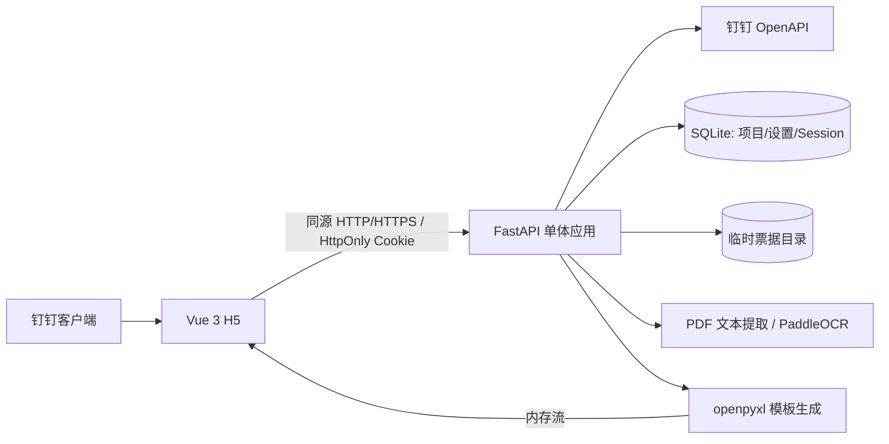

# 钉钉差旅报销 Excel 自动生成工具 - V1 实施方案

状态：V1 已实现，本文作为实施与验收契约  
日期：2026-09-02  
项目性质：公司内部单体 H5 工具；保持 V1 范围，不扩展为完整费控系统

> **范围说明：**本文只约束 Phase 1–5 的 Excel、本地 OCR、免登和基础安全能力。文中关于审批、关联出差、草稿恢复和持久附件的排除项，仅表示它们不在 Phase 1–5 交付边界内，不是当前完整产品的范围说明。当前草稿、原始附件、关联出差、最终 Excel 和钉钉 OA 提交以 [`DINGTALK_OA_INTEGRATION_DESIGN.md`](DINGTALK_OA_INTEGRATION_DESIGN.md) 为准。

## 1. 结论先行

V1 建议做成一个部署在公司钉钉工作台中的单体 H5 应用：Vue 3 前端、FastAPI 后端、SQLite 配置库、PaddleOCR 本地识别、openpyxl 基于公司模板生成 Excel、Nginx + Docker Compose 部署。OCR 和票据解析均在本地运行，生产环境不调用按次收费的 OCR、AI 或大模型 API。

本方案不原样照搬最初需求草案，已根据桌面真实样本做了以下修正：

1. 只处理独立票据文件；一个文件只允许包含一张票据。V1 的 PDF 必须为单页，多页 PDF 明确拒绝并提示拆分，不静默忽略后续页。
2. 当前自动解析范围先锁定为“铁路电子客票”和“旅客运输电子发票”；普通电子发票做通用金额/日期兜底，识别不完整时由用户修正。
3. 暂不处理打车行程单、汇总 PDF、PDF 合并、票据配对和 `merge.py`。
4. 数字 PDF 先提取原生文本，字段不足时才把已验证的单页 PDF 直接交给本地 PaddleOCR。当前 6 份有效样本都有文本层，无条件 OCR 反而更慢、更容易误识别数字。
5. 票据文件与 Excel 明细行在内部保持关联：每个独立文件直接生成一条可编辑费用明细，缺字段或识别失败也保留该行并提示修正。V1 不提供票据合并。
6. 出行日期优先于开票日期。铁路票取乘车日期，旅客运输发票取出行日期；只有缺失时才使用开票日期并给出警告。
7. 原成果 Excel 只有 4 条明细容量；当前脱敏模板保留 51 条基础明细样式，超过预留行时由后端受控复制样式、合并、类别下拉并下移总计行，因此 Excel 不再以模板行数作为业务上限。
8. 人民币大写由后端计算后写成文本，不继续依赖模板中的 `[DBNUM2]` 公式。该公式在非 Microsoft Excel 渲染器中已经出现 `#VALUE!`。
9. 生成的 Excel 直接写入内存并返回下载，不落服务器临时文件。服务器临时目录只保存待识别的上传票据。
10. 钉钉免登使用当前 `dd.requestAuthCode` 和当前组织应用 Token 接口，不使用历史 `dd.runtime.permission.requestAuthCode` 或旧 `/gettoken`。
11. 出差补助为可选项，默认不申请。每张关联审批保留独立来源记录；不连续审批分别形成补助项，日期重叠的审批合并为一个补助时段，员工只确认上午/下午；五项境内政策标准由管理员配置，默认分别为 `100/100/150/50/100` 元。市外项目按 30 个自然日边界自动选择短期或长期标准；同市项目自动计算并要求制度确认；公司内部出差超过 30 天不补助；境外不生成补助。
12. Excel 明细按发生时间排序，币种固定为人民币；补助作为普通输出行，发生日期写返回日期、票据张数固定为 0，并使用统一的日期区间与有效补助天数说明。
13. 旧版增值税发票二维码只作为金额和开票日期的本地补充证据；不得覆盖票面价税合计、乘车日期或客运发生日期，动态二维码和未知格式不访问网络并直接忽略。
14. 管理员可在补助设置上方按费用类别分组维护全部“关键词 → 费用类别”映射；所有词始终生效并可直接增删改或移动类别，不区分来源或启停状态。设置页和报销页共用后端类别契约；“其他”只作自动兜底，跨类别冲突仍返回“其他”，专用票据结构识别保持独立。

## 2. 产品边界

### 2.1 V1 必须实现

- 钉钉工作台 H5 入口和免登。
- 后端获取并确认员工姓名、合法部门列表和当前报销部门。
- 单部门自动带出；多部门只能从服务端确认过的部门中选择。
- 项目搜索、选择和手工填写。
- 可选的出差补助开关；申请时才填写类型、开始/结束日期和时间，并按 `12:00` 半天边界计算。
- 所有境内类型均由后端按半天规则自动计算。市外项目超过 30 个自然日按长期标准处理；同市项目要求制度确认；公司内部出差超过 30 天按 0 元处理。
- 文件选择器支持多选 JPG、JPEG、PNG、单页 PDF，前端逐文件发起上传请求。
- 一文件一票据；每个文件独立显示上传、识别、失败和重试状态。
- PDF 原生文本提取；文本不充分时将单页 PDF 直接交给本地 PaddleOCR 3.x 回退。
- 自动解析铁路电子客票、旅客运输电子发票；通用发票提供保守兜底。
- 自动提取并允许修改：类型、发生日期、说明、金额、票据张数。
- 铁路票提取出发站、到达站、乘车日期和票价。
- 旅客运输发票优先提取价税合计、出行日期、出发地、到达地和交通工具类型；铁路归“火车票”、航空归“飞机票”，只有命中已支持的公路/出租汽车类型才归“市内交通费”，无法可靠判断时归“其他”并提示人工确认。
- 手工新增、编辑、删除费用明细。
- 模板现有 17 个费用类别均使用集中定义的稳定代码/中文名称并可手工选择；V1 Parser 只自动识别已有样本支持的子集，未实现专用 Parser 的类别仍可手工填写。
- 每个独立票据直接对应一条 Excel 明细；超过模板基础预留行时自动扩展 Excel 明细区域。
- 后端重新计算补助、费用合计、总金额、票据张数和人民币大写。
- 基于脱敏后的公司模板生成 `.xlsx` 并即时下载。
- 项目/预算代码管理、五类补助标准、管理员鉴权。
- 上传文件自动过期清理；不保存报销历史，不保存 OCR 原文，不保存生成的 Excel。

### 2.2 V1 明确不实现

- 打车行程单解析。
- 汇总 PDF、票据合并、文件配对、`merge.py` 迁移。
- 一个 PDF 中包含多张票据或多页票据的拆分。
- 审批流、出差申请关联、发票验真、发票查重、ERP/财务系统对接、付款和预算控制。
- 机票舱位、住宿限额、自驾标准、跨年发票、票据粘贴/打印规范等合规审核或阻断。
- 历史报销单、草稿恢复、长期附件存储。
- 用户注册、密码登录、JWT LocalStorage 登录。
- 飞机票专用 Parser、酒店专用 Parser；没有真实样本前由通用发票和人工修正覆盖。
- Redis、持久任务队列、跨进程调度服务、微服务、Kubernetes、大模型；单进程内的 OCR 有界等待不属于持久任务队列。

## 3. 真实样本结论

### 3.1 成果 Excel

桌面 `差旅费报销单-测试员工.xlsx` 是当前确认的公司格式样例，但包含示例业务值和公式，不能直接提交。正式模板以其 `B:I` 八列表格、微软雅黑字体、灰色身份栏、蓝色总计栏、列宽、行高、边框、总金额人民币会计格式和页边距为基准，制作成单工作表脱敏版本。

| 字段 | 现有位置 | V1 处理 |
|---|---:|---|
| 标题 | `B1:I1` | 保留“费用报销单”及样式 |
| 姓名 | `C2` | 只写 Session 中的姓名 |
| 部门 | `E2` | 只写 Session 中已验证的部门 |
| 报销项目/预算代码 | `G2:I2` | 写入“项目/预算代码 项目名称”或手工项目文本；保留正式模板的实际表头 |
| 费用类别 | `B4:B54` | 每条明细写入一行 |
| 发生日期 | `C4:C54` | 允许单日期或用户手工填写的展示文本 |
| 说明 | `D4:F54` | 每行保持合并 |
| 金额 | `G4:G54` | 写入后端量化到两位的普通数值 |
| 币种 | `H4:H54` | V1 固定“人民币” |
| 票据张数 | `I4:I54` | 按关联票据数或手工明细确认值 |
| 人民币大写 | `C55:F55` | 后端写入静态文本 |
| 总金额 | `G55` | 后端重算并写入人民币会计格式静态数值 |
| 总票据张数 | `I55` | 后端重算并写入静态整数 |

正式脱敏模板提供 17 个费用类别的下拉词表，并保留第 4–54 行作为基础明细样式。51 条以内隐藏未使用行；超过时复制第 54 行格式和 `D:F` 合并、扩展 `B` 列类别验证，将第 55 行总计及打印区域按实际明细数下移。

模板制作规则：

- 从成果样例复制一份新文件，不直接把含真实姓名和业务数据的文件提交到仓库。
- 清空姓名、部门、项目、明细、金额和票据数。
- 复制公开样式属性、行高、列宽、边框、合并单元格和数据验证；不依赖私有 `_style`。
- 明细范围为 4–54 行，每行合并 `D:F`；总计行为 55 行，合并 `C:F`。
- 保留微软雅黑字体、灰色员工信息带、蓝色合计行、总金额人民币会计格式、A4 纵向、页边距和打印设置。
- `C55`、`G55`、`I55` 运行时由后端写值，不保留计算公式。
- 所有来自用户、钉钉或 OCR 的文本（包括姓名、部门、项目、日期文本和说明）必须通过同一个 `write_safe_text()` 写入。若首字符为 `=`、`+`、`-`、`@`，先添加文本转义前缀并强制写为字符串，不能让 openpyxl/Excel 将其保存或执行为公式。
- 输出明细按可比较的发生日期升序排列；同日保持原始录入/上传顺序。
- 币种列统一写“人民币”，V1 不处理外币和汇率换算。
- 出差补助行的发生日期写返回日期，说明统一为“开始日期—结束日期，共 N 天出差补助”；票据张数固定为 0。

### 3.2 当前票据样本

- 4 份旅客运输电子发票和 2 份铁路电子客票均为单页、未加密 PDF。
- 6 份 PDF 都有文本层，因此解析顺序必须是“原生文本 -> 字段解析 -> 必要时 OCR”。
- 旅客运输发票版式和页面尺寸不统一，不能依赖固定坐标裁剪。
- 同一张旅客运输发票中“合计”可能是不含税金额；报销金额必须优先取“价税合计（小写）”。
- 开票日期可能晚于实际出行日期；Excel 发生日期应取出行日期。
- 铁路电子客票应取乘车日期而不是开票日期，路线保留原站名，用户可在页面中简化。

真实票据仅用于本机验收，不复制进 Git，不进入测试快照，不输出到日志。

### 3.3 报销制度截图中与本工具有关的业务口径

截图来自无法下载的公司报销制度材料，其中审批、验真、付款、票据粘贴等内容仅作为背景，不进入本工具范围。对 Excel 生成有直接影响的事实如下：

- 出差时间精确到分钟，以公司时区 `12:00` 为半天边界；`12:00` 整点归入后半天。跨日时出发日 12:00 前计 1 天、之后计 0.5 天，返回日 12:00 前计 0.5 天、之后计 1 天，中间自然日各计 1 天；同日跨过 12:00 计 1 天，否则计 0.5 天。结束时间早于开始时间时报错。
- 员工只选择一个“市外项目”类型。后端按开始、结束日期计算连续自然日：30 天以内（含）自动使用管理员配置的短期标准，超过 30 天自动使用长期标准；前端不能直接提交“短期”或“长期”分类。
- 商务出差和市外项目短期的开发默认标准均为 `100.00`；市外项目长期默认 `150.00`、同市项目默认 `50.00`、公司内部出差默认 `100.00`，五项后台政策标准都可由管理员调整。所有境内类型按半天规则自动计算；同市项目只增加制度确认勾选；公司内部出差超过 30 个自然日时标准和金额按 `0.00` 计算。
- Excel 明细按出差相关费用的发生时间顺序排列；币种固定为人民币；费用类别分行填写，不把所有费用合并成一个笼统金额。
- 用户界面统一称“报销项目/预算代码”。本工具只负责选择或填写并输出文本，不校验预算余额或审批权限。

截图并不能证明制度仍为现行版本。上线验收必须由业务负责人确认上述标准；在确认前它们作为可配置默认值，而不是不可变常量。

## 4. 推荐架构



### 4.1 技术栈

前端：

- Vue 3、Vite、TypeScript。
- Vue Router、Pinia、Axios、Element Plus。
- Vitest；关键流程增加少量 Playwright E2E。
- `dingtalk-jsapi` 调用当前 `dd.requestAuthCode`。

后端：

- Python 3.11+、FastAPI、Uvicorn、Pydantic v2。
- SQLAlchemy 2.x、Alembic、SQLite。
- HTTPX 调钉钉 OpenAPI。
- pypdf 做 PDF 页数/加密校验和数字 PDF 文本提取。
- PaddleOCR 3.x 本地 CPU 推理；文本不足时可直接读取单页 PDF，使用 `PaddleOCR(...).predict()`，不混用 2.x `ocr.ocr()`。
- openpyxl 加载并填充 `.xlsx` 模板。
- pytest、pytest-asyncio、httpx 测试客户端。

部署：

- Docker Compose Specification，不写废弃的顶层 `version`。
- 应用可直接使用 HTTP，也可放在 HTTP/HTTPS 入口后；容器内 Nginx 提供同源 Vue 静态文件与 `/api` 反向代理，并丢弃调用方转发链。
- 单个 FastAPI 实例起步；SQLite 使用持久卷，临时票据目录使用独立临时卷或宿主机受限目录。
- PaddleOCR/PaddlePaddle 包在 OCR 镜像构建时按锁文件安装；模型只通过已核验的离线只读制品挂载，生产运行时不自动联网下载。

### 4.2 免费与离线约束

- V1 固定 `OCR_MODE=local`；禁止使用 `PaddleOCRClient`、云 OCR 地址、访问令牌或任何按次计费的模型接口。
- OCR 模型随镜像发布或以只读卷挂载。完成钉钉身份交换后，票据识别与 Excel 生成不依赖公网服务。
- 不为 OCR 引入 PyMuPDF。PaddleOCR 3.x 已能直接读取本地 PDF，V1 无需额外 PDF 渲染器，也避免其 AGPL/商业双许可证带来的合规判断。
- 暂不同时维护第二套 OCR 引擎。若目标服务器的 PaddleOCR CPU 内存、启动时间或识别速度不达标，再用相同脱敏样本基准测试 Apache-2.0 的 RapidOCR + ONNX Runtime，达标后才替换。
- 生产优先使用 Linux 上的 Docker Engine + Compose plugin。公司开发机若使用 Docker Desktop，需复用已有授权或先确认公司是否满足其免费条件，不能把 Docker Desktop 默认计入“永久免费”。
- 这里的“免费”指无 OCR/API 按次费用及无新增商业软件许可证；服务器、域名、证书运维和公司钉钉能力是否产生既有基础设施成本需单独核算。

## 5. 核心领域模型

### 5.1 浏览器当前报销状态

```ts
interface OcrReceiptCandidate {
  fileId: string
  type: 'train' | 'invoice' | 'other'
  categoryId: string
  categoryName: string
  date: string | null
  description: string | null
  amount: string | null
  receiptCount: 1
  source: 'ocr'
  confidence: string
  warnings: string[]
  status: 'recognized' | 'failed'
  error: { code: string; message: string } | null
}

interface ExpenseLine {
  id: string
  category: ExpenseCategory
  date?: string
  displayDate: string
  description: string
  amount: string
  receiptCount: number
  source: 'ocr' | 'manual' | 'system'
}

interface TripInput {
  tripType: 'business' | 'project' | 'same_city_project' | 'internal'
  startDate: string
  startTime: string
  endDate: string
  endTime: string
  policyConfirmed?: boolean
  confirmedEffectiveDays?: string
  noSubsidyException?: boolean
}
```

日期使用 `YYYY-MM-DD`，时间使用本地 `HH:MM` 且不接受秒、时区偏移、空白或非补零格式。金额和有效天数在 JSON 中使用十进制字符串，后端进入领域层后转 `Decimal` 并统一量化。管理员配置的五项境内每日标准必须大于 `0` 且不超过 `10000.00` 元；员工不能在报销请求中提交每日标准或有效天数。每张关联审批保留一个原始补助输入；计算前按日期重叠关系归并，最终每个合并时段生成一个 `receiptCount=0` 的补助明细，排序日期和发生日期取合并时段的返回日期；同市项目的制度确认作用于整个合并时段。

`ExpenseCategory` 使用下列 17 个稳定代码；代码、中文名称、显示顺序和启用状态只在后端公共契约中定义一次，并由 API 提供给前端，Parser 和 Excel service 只引用代码，不各自维护枚举：

| 稳定代码 | Excel/页面名称 |
|---|---|
| `airfare` | 飞机票 |
| `rail_fare` | 火车票 |
| `local_transport` | 市内交通费 |
| `lodging` | 住宿费 |
| `subsidy` | 出差补助 |
| `office` | 办公费 |
| `hospitality` | 招待费 |
| `communications` | 通讯费 |
| `employee_welfare` | 福利费 |
| `consulting` | 咨询费 |
| `advertising` | 广告费 |
| `leasing` | 租赁费 |
| `property_management` | 物业费 |
| `utilities` | 水电费 |
| `labor_service` | 劳务费 |
| `conference` | 会议费 |
| `other` | 其他 |

17 类都可手工填写，但“可选择类别”与“自动识别能力”是两个概念。V1 Parser 自动分类仅覆盖 `rail_fare`，以及旅客运输发票中有明确交通工具证据的 `rail_fare`、`airfare`、已支持公路/出租汽车类型的 `local_transport`；通用或不确定票据返回 `other` 和人工确认警告。新增类别不要求同时新增 OCR Parser。

### 5.2 SQLite 持久化数据

预算代码不在本系统维护；系统从关联的钉钉出差审批读取所属公司和预算代码，并把预算代码完整名称写入报销 Excel。

`settings`

- `key`
- `value`
- 初始设置：五个类型标准 `100.00/100.00/150.00/50.00/100.00`，以及 `calculation_mode=half_day_12`。
- 这些值只提供 Excel 计算标准，不构成预算、审批或合规判断；特殊类型的用户确认值只存在于当前页面状态和本次生成请求中，不入库形成报销历史。

`sessions`

- 随机 Session ID 的哈希，不保存明文 Cookie 值。
- `dingtalk_user_id`、`name`。
- 服务端确认过的部门列表 JSON、当前部门 ID 和名称。
- CSRF token 哈希。
- `created_at`、`expires_at`、`last_seen_at`。

不创建 reimbursement、expense、receipt history 等持久化表。

## 6. 钉钉免登与安全设计

### 6.1 当前官方免登链路

1. 前端读取公开配置中的公司 CorpId 和 Client ID。
2. 钉钉端内调用：

   ```ts
   dd.requestAuthCode({ clientId, corpId, success, fail, complete })
   ```

3. 前端立即以 JSON POST 将一次性 `code` 发送到 `/api/auth/dingtalk`；不放查询串、不写日志。
4. 后端固定使用服务端 `DINGTALK_CORP_ID` 调：

   ```http
   POST https://api.dingtalk.com/v1.0/oauth2/{corpId}/token
   ```

   请求包含 `client_id`、`client_secret`、`grant_type=client_credentials`。应用 Token 缓存到接近过期，不在每次登录时重复获取。
5. 后端用 Token 和免登码调 `POST /topapi/v2/user/getuserinfo` 得到 `userid`。
6. 后端调 `POST /topapi/v2/user/get` 得到权威姓名和 `dept_id_list`。
7. 后端逐个调 `POST /topapi/v2/department/get` 得到合法部门名称。
8. 只有使用公司固定组织应用凭据成功兑换的用户才能建立 Session。

`getuserinfo` 当前不返回 CorpId，所以不能实现“从响应读取 CorpId 再比较”。本系统的组织校验定义为：后端固定绑定公司 CorpId 和应用凭据，绝不接受前端指定组织；前端 `$CORPID$` 比较只作为提前提示。

### 6.2 Session 与 CSRF

- Cookie 名：`expense_session`。
- Cookie 只保存 256 位随机不透明值；SQLite 保存其哈希和身份数据。
- Cookie 属性：`HttpOnly; SameSite=Lax; Path=/`；`Secure` 由 `SESSION_COOKIE_SECURE` 按入口协议可选开启。
- 登录响应额外返回 Session 绑定的 CSRF token；所有 POST/PUT/DELETE 业务请求通过 `X-CSRF-Token` 携带并校验。
- CSRF token 只存在前端内存，不写 LocalStorage、SessionStorage 或 Cookie。页面刷新/内存丢失后，前端用现有 HttpOnly Session 调用 `GET /api/me`；后端为该 Session 原子轮换 CSRF token 哈希，并在成功响应中返回新的明文 token，前端覆盖内存值。旧 token 立即失效；Session 不存在或过期仍返回 401，不借此重建身份。
- 生产前后端同源；开发期用 Vite `/api` 代理，不启用通配 CORS 凭据。
- Logout 删除服务端 Session、Cookie 和当前 Session 的临时票据目录。
- 开发免登只能通过 `APP_ENV=development` 的专用 mock 配置启用；生产启动时若发现 mock auth 必须直接失败。

### 6.3 多部门

- 一个部门：自动选中。
- 多个部门：页面要求用户从后端返回的合法列表中选择；不能自由输入。
- 用户通过 `/api/me/department/from-travel-approval` 由已核验出差审批绑定部门；Excel 生成接口不接收 `departmentId` 或部门名称，只写入当前 Session 已确认的部门。
- 不默认把 `dept_id_list[0]` 当主部门，因为官方文档没有该保证。

## 7. 文件、文本提取与 OCR 管线

### 7.1 上传限制

- 扩展名与实际 magic bytes 双重校验：JPG/JPEG/PNG/PDF。
- 单文件不超过 20 MiB，每个请求必须且只能包含一个文件；每个 Session 跨请求默认最多保留 200 个文件、合计 100 MiB。文件数和总大小是两个独立、可配置的技术保护上限。
- 先取得全局上传准入和 Session 租约，再用独立 SQLite 查询重新确认 Session 主键、公司和有效期，最后才消费请求体。流式 multipart 回调限制普通字段为 0，并在写入缓存前累计单文件、Session 与全局字节。`Content-Length` 仅作提前拒绝提示，不替代流式计数。
- 图片使用 Pillow 验证格式并限制总像素，防止解压炸弹。
- PDF 必须未加密、恰好 1 页；多页返回 `MULTI_PAGE_PDF_UNSUPPORTED`。
- 原始文件名仅作页面显示；磁盘名为随机 UUID，不拼接用户路径。
- 路径固定为 `<TEMP_DIR>/<sessionUuid>/<fileUuid>.<safeExt>`，访问前验证目标仍位于 Session 目录内。
- Nginx `client_max_body_size` 设为 25 MiB，为一个 20 MiB 文件的 multipart 边界和请求头预留余量；100 MiB 只作为 Session 跨请求保留额度。

### 7.2 临时文件

- 只保存上传票据，不保存生成的 Excel。
- 文件超过 30 分钟未使用后进入清理范围、后台每 10 分钟扫描，因此通常在未使用约 30～40 分钟内删除；按每个文件的修改时间判断，不依赖 Session 目录时间。TTL 配置必须安全大于 OCR 120 秒超时及 60 秒余量。
- 每个 Session 跨重复请求默认最多保留 200 个文件和 100 MiB。解析缓存固定在 `<TEMP_DIR>/.spool`，显式内存阈值为每文件 256 KiB，超过后落入可计量/可清理的命名 spool；转存最终文件时逐个关闭并删除 spool。
- 全局默认上限 768 MiB，活动/残留 spool、最终文件和 `.part` 全部计入准入扫描；额外保留一个 20 MiB 文件的转存峰值和 200 MiB 运行时余量，因此最坏配置低于 1 GiB tmpfs。
- 上传、OCR、删除、Logout 和清理使用 Session 操作租约；上传、OCR 和删除取得租约后用独立 SQLite 查询复验 Session 主键、公司和有效期，并持有租约覆盖完整文件操作。这样 Logout 先完成时等待操作返回 401 且不重建目录，文件操作先准入时 Logout 等待并在随后删除；清理跳过活动 Session 并只删除过期文件。
- 服务启动时先清理过期目录；删除必须幂等并拒绝符号链接逃逸。
- UI 明示“票据仅临时处理，超时后需重新上传”。

### 7.3 识别顺序

```text
文件校验
  -> PDF 页数/图片安全检查
  -> PDF 原生文本提取
  -> 文本质量门槛（长度、关键标签、金额/日期候选）
  -> 若不足：单页 PDF 直接本地 OCR / 图片按需标准化
  -> PaddleOCR 3.x predict()
  -> 文本标准化
  -> Parser 匹配
  -> 字段提取 + 候选整体 confidence + warnings
  -> 用户确认
```

OCR 是 CPU 密集同步工作，不直接放在 `async def` 事件循环中。V1 用标准库 `multiprocessing` 隔离图片验证、PDF 处理和 OCR。文件验证使用独立单槽及短准入等待；OCR 全局执行容量固定为 1，前置一个进程内有界 FIFO 队列（默认 8 个等待请求、150 秒），因此多用户请求按到达顺序准入但不会增加并行模型数量。队列满或等待超时返回 `OCR_BUSY`；执行超时或取消会终止并回收 OCR 进程，完成清理后才释放准入令牌。持久 `RUNNING` 的陈旧窗口覆盖最大排队与执行时间，排队中的任务不会被清理逻辑误判为中断。

### 7.4 前端票据交互

- 票据状态只保存在 Pinia 内存：`queued/uploading/uploaded/recognizing/recognized/done/failed/deleted`；不写 `localStorage` 或 `sessionStorage`。
- 选择文件时用整数 byte 做 20 MiB/50 个/100 MiB 提示校验，后端仍是最终校验方。客户端明显无效的文件单独拒绝，不阻断其余文件。
- 每个 multipart 请求的 `files[]` 必须且只能包含一个文件。文件选择器可多选，前端按选择顺序逐文件上传并识别；任一文件失败只标记该文件并继续下一张，不做整批回滚、拆批重试或错误扩散。
- OCR 每次请求体为 `{ "fileIds": ["不透明临时 ID"], "tripYear": 2026 }`，数组长度严格为 1，前端逐文件串行调用；同一 `fileId` 只关联一条费用明细。用户明确点击“重新识别”时 upsert 同一行，不生成重复明细。
- OCR 类别必须存在于服务端加载的类别契约中。金额按两位十进制字符串规范化；日期或金额缺失时不编造值，而是保留可编辑的问题明细并阻止最终计算/Excel，直到用户编辑完成。
- OCR 禁用或不可用时，文件上传、手工新增费用和 Excel 闭环仍可使用；页面只提示本地 OCR 不可用，不回退云服务。
- 员工页面不提供独立的“删除服务器文件”操作。用户删除 OCR 费用行时由应用同步清理其临时文件；文件超过 30 分钟未使用后仍由后台周期清理，退出登录时立即清理。退出、401 或表单重置会中止当前请求并清空前端文件状态。
- UI 明确一文件一票据、PDF 仅一页；汇总 PDF、行程单、多页拆分和 `merge.py` 均不支持。页面不展示完整 OCR 原文。

### 7.5 Parser

```py
class BaseReceiptParser(Protocol):
    def match(self, lines: list[OcrLine]) -> float: ...
    def parse(self, lines: list[OcrLine], context: ParseContext) -> ParsedExpense: ...
```

V1 实现顺序：

1. `TrainTicketParser`
   - 关键词：铁路电子客票、车次、票价、站。
   - 日期优先：乘车日期 > 开票日期。
   - 金额优先：票价标签附近的人民币金额。
   - 说明：`出发站-到达站`，保留南/北/东/西等站名后缀。
2. `GenericInvoiceParser`
   - 关键词：电子发票、旅客运输服务、出行人、出行日期、交通工具类型。
   - 日期优先：出行日期 > 开票日期。
   - 金额优先：价税合计（小写） > 价税合计（大写解析） > 合计加税额；禁止直接取不含税合计。
   - 从“交通工具类型”等票面字段提取规范化运输类型，不能仅凭“旅客运输服务”笼统归类。
   - 明确铁路类型归 `rail_fare`（火车票），明确航空类型归 `airfare`（飞机票）；只有命中已实现并有测试样本覆盖的公路/出租汽车类型才归 `local_transport`（市内交通费）。
   - 交通工具缺失、值未知或证据冲突时归 `other`，返回 `MANUAL_REVIEW_REQUIRED` 警告；说明仍可优先使用出发地-到达地。
   - 同时承担通用发票保守兜底：没有唯一可靠的交通工具/住宿证据时类别为“其他”，必须提示人工确认。
   - 不把“电子客票行程单”作为航空分类证据；V1 不处理行程单。
3. `FallbackParser`
   - 识别请求以成功状态返回空字段候选项，并在 `warnings` 中包含 `MANUAL_REVIEW_REQUIRED`，不阻断后续手工录入。

不要把所有正则堆在一个文件；公共金额、日期、文本规范化放在独立 utility 中。原始 PDF 文本和 OCR 文本只在本次请求内存中存在。

## 8. Excel 生成设计

### 8.1 请求体

前端请求顶层只允许 `project`、`trip`、`items`，不能提交姓名、部门、天数、补助总额、总金额或人民币大写：

```json
{
  "project": {
    "mode": "selected",
    "id": 1
  },
  "trip": {
    "tripType": "business",
    "startDate": "2026-06-30",
    "startTime": "09:00",
    "endDate": "2026-07-07",
    "endTime": "18:00"
  },
  "items": [
    {
      "category": "local_transport",
      "date": "2026-07-01",
      "displayDate": "7月1日、7月6日",
      "description": "市内交通",
      "amount": "44.89",
      "receiptCount": 4
    }
  ]
}
```

手工项目用 `mode=manual` 和受长度限制的 `text`。费用行只允许类别、必填发生日期、显示日期、说明、金额和票据张数；不接受 `id`、`source`、身份、汇总或补助行。OCR 结果在前端直接成为可编辑费用行，Excel 接口仍不接收临时文件 ID。

任何类型都不接收前端提交的补助天数、每日标准或补助总额；这些值统一从审批日期、员工确认的上午/下午及系统设置重新计算。同市项目必须提交 `policyConfirmed=true`，但不接收人工有效天数。公司内部出差超过 30 个自然日自动按 0 元计算。

### 8.2 服务端权威计算

- 姓名和部门来自 Session。
- 已选项目从数据库重新读取；手工项目仅作本次输出文本。
- 日期按 `YYYY-MM-DD`、时间按本地 `HH:MM` 解析；结束早于开始直接报错。
- 境内补助按 12:00 半天边界计算；同市项目还必须有制度确认。
- 五项境内每日补助标准只从设置表读取；员工请求不能覆盖。市外项目短期连续天数必须 `<=30`、长期必须 `>30`；公司内部出差超过 30 天自动不补助。
- 补助金额、每行金额、费用合计和总金额全用 `Decimal`。
- 票据张数使用每条严格校验并经用户确认的值，补助行固定 0；Excel 接口不依赖临时票据文件。
- 人民币大写由 `amount_to_chinese_uppercase()` 计算。
- 明细按必填 `date` 升序稳定排序，同日保持前端确认顺序；补助行的排序日期和发生日期取返回日期，并排在同日用户明细之后，说明为“开始日期—结束日期，共 N 天出差补助”。
- 所有明细币种固定写“人民币”。
- Excel 动态扩展，不设置模板行数上限。部署默认以 `EXPENSE_MAX_ITEMS=200` 作为可配置的请求资源保护值，可选补助由后端额外生成；超过该技术值时返回 `TOO_MANY_EXPENSE_LINES`。

### 8.3 返回方式

- 从固定路径 `backend/app/templates/expense_template.xlsx` 使用 `load_workbook(template_path, read_only=False, data_only=False)` 打开脱敏模板。加载前对 ZIP 包执行 fail-closed 预检：文件不超过 10 MiB、最多 200 个条目、单条目解压后不超过 20 MiB、总解压体积不超过 50 MiB、压缩比不超过 200，并拒绝重复、大小写冲突、绝对或越界路径。只允许唯一且可见的 `费用报销模板`，并校验固定标签、必要合并区域和唯一 `B4:B54` 数据验证；不符合时返回 `EXCEL_TEMPLATE_INVALID`。生成时按实际明细动态扩展合并区域、验证范围、总计坐标和打印区域，并保持样例的页边距与 A4 纵向打印设置。
- 模板和生成后的工作簿均不得包含公式、超链接、额外或隐藏工作表、意外定义名称、打印标题、条件格式、Excel 表格或计算列、透视表、图表、图片/绘图、切片器、批注/注释、外部关系、宏/VBA、数据连接、QueryTable、ExternalLink、ActiveX、OLE 或嵌入包。实现只验证并拒绝，不尝试清洗或修复不可信 Office 文件。
- 填入身份、项目和明细；51 条以内隐藏未使用的 4–54 行，超过时按基础行样式动态扩展。
- 所有外部来源文本都通过集中 `write_safe_text(cell, value)` 写入，先清理控制字符并限制长度；去除前导空白后首字符为 `=`、`+`、`-`、`@` 时添加文本转义前缀并强制字符串类型。类别中文名来自受控映射，金额和票据数使用数值写入函数，二者不混用。
- 后端把总金额、人民币大写和票据张数写成静态值。
- 保存到 `io.BytesIO`，使用 `StreamingResponse` 返回，不创建 `result.xlsx`。
- `Content-Type` 为标准 xlsx MIME；`Content-Disposition` 使用经过清理和 RFC 5987 编码的中文文件名。
- 文件名格式：`差旅费报销单-姓名-项目编号或项目.xlsx`；替换 `/\\:*?"<>|` 和控制字符。前端以 Blob 下载、解析服务端 RFC 5987 文件名并及时释放对象 URL。

### 8.4 模板替换与当前 QA

运行时映射集中在 `backend/app/excel/template_contract.py`，不得把坐标复制到路由：`C2` 姓名、`E2` 部门、`G2:I2` 项目；第 4–54 行的 `B`、`C`、`D:F`、`G`、`H`、`I` 依次为类别、日期、说明、金额、币种、票据张数；第 55 行的 `C:F`、`G`、`I` 依次为人民币大写、总金额和总票据数。

替换公司模板时必须：

1. 只操作脱敏副本，不覆盖桌面业务样例原件。
2. 工作簿只能有一个可见工作表且名称必须为 `费用报销模板`；基础模板保持上述标签和坐标、`D4:F54`/`C55:F55` 合并及既有字体、边框、行高、列宽和页边距；不得设置打印标题。运行时仅由生成服务按实际明细扩展行、下移总计和打印终点，并保持样例的 A4 纵向、页边距和打印设置。
3. 唯一数据验证必须是 `B4:B54` 的列表验证，`formula1` 必须严格等于双引号包裹的 `飞机票,火车票,市内交通费,住宿费,出差补助,办公费,招待费,通讯费,福利费,咨询费,广告费,租赁费,物业费,水电费,劳务费,会议费,其他`，不得使用自定义或公式型验证或第二公式。
4. 不加入公式、超链接、其他定义名称、条件格式、Excel 表格/计算列、透视表、图表、图片/绘图、切片器、批注/注释、外部关系或链接、宏/VBA、数据连接、QueryTable、ExternalLink、ActiveX/OLE、嵌入包或真实员工/项目数据；模板还必须通过上述 ZIP 预检及严格部件白名单。
5. 替换 `backend/app/templates/expense_template.xlsx` 后运行完整 Excel 回归；不能通过放宽模板契约掩盖结构差异。

脱敏样例位于 `outputs/phase4_excel_20260901/差旅费报销单-示例.xlsx`，可读预览位于同目录的 `差旅费报销单-示例预览.png`。程序检查确认值、合并、样式、打印设置、无公式和无外部链接；LibreOffice 确认输出为一页纵向 A4。当前沙箱因 CJK 字体缓存不可写而无法用 LibreOffice 可靠显示中文，因此正式模板的最终视觉验收仍需在公司 Microsoft Excel 环境完成。

## 9. API 设计

所有 JSON API 统一返回 `success/data` 或 `success=false/error`；下载接口直接返回文件。

| 方法 | 路径 | 鉴权 | 用途 |
|---|---|---|---|
| GET | `/api/health` | 无 | 健康检查 |
| GET | `/api/ready` | 无 | SQLite、模板、临时目录及已启用本地 OCR 的就绪检查 |
| GET | `/api/config/public` | 无 | 返回 CorpId、Client ID、上传限制等非敏感配置 |
| POST | `/api/auth/dingtalk` | authCode | 钉钉免登并建立 Session |
| POST | `/api/auth/logout` | Session + CSRF | 退出并清理当前上传缓存 |
| GET | `/api/me` | Session | 当前用户和管理员标识 |
| POST | `/api/me/department/from-travel-approval` | Session + CSRF | 按已核验出差审批绑定报销部门 |
| GET | `/api/settings` | Session | 读取补助显示配置 |
| GET | `/api/expense-categories` | Session | 读取 17 类集中费用契约及手工可选标记 |
| POST | `/api/calculate/totals` | Session + CSRF | 重算费用、补助、总额、票据数和人民币大写 |
| POST | `/api/reimbursements/drafts/{draftId}/files` | Session + CSRF | 上传并持久保存一份报销材料 |
| POST | `/api/reimbursements/drafts/{draftId}/files/{fileId}/ocr` | Session + CSRF | 识别一份已保存材料 |
| POST | `/api/reimbursements/drafts/{draftId}/excel-preview` | Session + CSRF | 从当前已保存报销生成 Excel 预览 |
| PUT | `/api/admin/settings` | Admin + CSRF | 修改五项境内每日补助标准；计算模式固定为 `half_day_12` |

管理员由 `ADMIN_USER_IDS` 环境变量配置。前端路由守卫只改善体验，后端依赖注入才是权限边界。

主要错误码：

- `UNAUTHORIZED`、`FORBIDDEN`、`INVALID_CORP_CONTEXT`。
- `DINGTALK_AUTH_FAILED`、`DINGTALK_PERMISSION_MISSING`。
- `INVALID_DATE_RANGE`、`INVALID_DEPARTMENT`。
- `INVALID_TRIP_TIME`、`INVALID_TRIP_DURATION`、`INVALID_SUBSIDY_INPUT`、`SUBSIDY_CONFIRMATION_REQUIRED`、`INVALID_SUBSIDY_EXCEPTION`。
- `UNSUPPORTED_FILE`、`FILE_TOO_LARGE`、`TOO_MANY_FILES`、`SESSION_FILE_LIMIT`、`SESSION_STORAGE_LIMIT`、`TEMP_STORAGE_FULL`、`UPLOAD_BUSY`、`FILE_OPERATION_BUSY`。
- `MULTI_PAGE_PDF_UNSUPPORTED`、`ENCRYPTED_PDF_UNSUPPORTED`、`PDF_PAGE_TOO_LARGE`、`PDF_TOO_COMPLEX`、`IMAGE_VALIDATION_TIMEOUT`、`PDF_VALIDATION_TIMEOUT`、`PROCESS_RESOURCE_LIMIT`。
- `OCR_DISABLED`、`OCR_BUSY`、`OCR_TIMEOUT`、`OCR_FAILED`。
- `TOO_MANY_EXPENSE_LINES`、`EXCEL_TEMPLATE_INVALID`、`EXCEL_GENERATION_FAILED`。

`MANUAL_REVIEW_REQUIRED` 不是 API 错误码，而是成功识别结果的 `warnings[]` 值。无法可靠分类或字段不完整时返回 `success=true` 的候选项，让用户修正；只有文件读取失败、OCR/解析管线异常且无法返回候选项时才使用对应的稳定错误码。

## 10. 目录结构

```text
dingtalk-travel-reimbursement/
├── frontend/
│   ├── src/
│   │   ├── api/
│   │   ├── components/
│   │   │   ├── reimbursement/   # 补助、费用明细与 Excel 下载业务组件
│   │   │   └── settings/        # 分类关键词与补助标准管理组件
│   │   ├── router/
│   │   ├── stores/              # Session 和当前报销单内存状态
│   │   ├── types/
│   │   ├── utils/
│   │   └── views/
│   │       ├── ReimburseView.vue
│   │       └── SettingsAdminView.vue
│   ├── package.json
│   └── vite.config.ts
├── backend/
│   ├── app/
│   │   ├── api/                 # 薄 HTTP 路由与鉴权依赖
│   │   ├── core/                # 配置、错误、日志与安全基础设施
│   │   ├── database/
│   │   ├── domain/              # 金额、补助和费用汇总纯业务规则
│   │   ├── excel/               # 公司模板契约和坐标映射
│   │   ├── models/
│   │   ├── ocr/                 # 本地 OCR、PDF/二维码证据和 Parser
│   │   ├── schemas/
│   │   ├── services/            # 钉钉、Session、临时文件、OCR 与 Excel 用例
│   │   ├── templates/
│   │   │   └── expense_template.xlsx
│   │   └── main.py
│   ├── migrations/
│   ├── models/                  # 不入库的本地 OCR 模型目录
│   ├── tests/
│   └── pyproject.toml
├── scripts/
│   ├── dev-*.sh                 # 本地开发启动脚本
│   └── check-*                  # 部署策略与 OCR 制品检查
├── nginx/
├── docs/
├── docker-compose.yml
├── .env.example
└── README.md
```

## 11. 分阶段实施计划

### Phase 0 - 文档与业务基线冻结

要完成：

- 把本方案、真实模板映射和 V1 排除项写入 README。
- 记录成果 Excel 的候选模板版本并由它制作开发用脱敏模板；公司确认正式模板版本是 Phase 4 业务验收依赖，不阻止 Phase 1 骨架开发。
- 记录制度截图仅作背景资料；V1 明确采用 12:00 半天边界。管理员配置五项境内标准，默认 `100/100/150/50/100`；同市项目要求制度确认，公司内部出差超过 30 天自动不补助，境外不生成补助。公司正式确认仍是生产上线验收依赖。
- 确认项目/预算代码清单、管理员 ID、钉钉 CorpId/Client ID/Secret、应用域名和权限。
- 确认多部门采用“用户从合法列表选择”。
- 固定依赖大版本，特别是 PaddleOCR 3.x，不复制 2.x 示例。

文档依据：

- 钉钉：[H5 免登](https://open.dingtalk.com/document/development/enterprise-internal-application-logon-free)、[`dd.requestAuthCode`](https://open.dingtalk.com/document/orgapp/jsapi-request-auth-code)、[应用 Token](https://open.dingtalk.com/document/development/api-gettoken)、[免登码换用户](https://open.dingtalk.com/document/development/obtain-the-userid-of-a-user-by-using-the-log-free)、[用户详情](https://open.dingtalk.com/document/development/query-user-details)、[部门详情](https://open.dingtalk.com/document/development/query-department-details0-v2)。
- FastAPI：[Cookie](https://fastapi.tiangolo.com/advanced/response-cookies/)、[文件上传](https://fastapi.tiangolo.com/tutorial/request-files/)、[响应](https://fastapi.tiangolo.com/reference/responses/)。
- PDF：[pypdf 文本提取](https://pypdf.readthedocs.io/en/stable/user/extract-text.html)。
- OCR：[PaddleOCR 3.x Quick Start](https://www.paddleocr.ai/main/en/quick_start.html)、[General OCR Pipeline（本地 PDF 输入）](https://www.paddleocr.ai/main/en/version3.x/pipeline_usage/OCR.html)。
- Excel：[openpyxl 模板加载](https://openpyxl.readthedocs.io/en/stable/tutorial.html#loading-from-a-file)、[样式与合并单元格](https://openpyxl.readthedocs.io/en/stable/styles.html)。
- 部署：[Compose 启动与健康检查](https://docs.docker.com/compose/how-tos/startup-order/)。

验证：

- 输入清单、排除清单及尚待业务确认的模板/制度版本均有明确记录；待确认项按阶段门禁管理，不阻塞 Phase 1。
- 真实敏感样本未复制进仓库。
- 代码任务中引用的 API 名称均能在上述当前官方文档找到。

禁止：

- 依据旧 Demo 猜测 API。
- 把截图中的多档标准、半天或特殊扣除条件擅自加入 V1。
- 把审批、验真、付款、票据粘贴或预算控制扩进 Excel 生成工具。
- 直接提交含真实业务数据的成果 Excel。

### Phase 1 - 基础项目与可运行骨架

要实现：

- 创建 Vue 3 + Vite + TypeScript 前端和 FastAPI 后端。
- 建立 SQLAlchemy/Alembic：settings、sessions 及报销业务表。
- 建立统一配置、错误响应、结构化脱敏日志和 request ID。
- 完成 `/api/health`、Vite `/api` 代理、基础 Dockerfile 和 Compose。
- 建立 pytest、Vitest、lint/typecheck 命令。

复制依据：

- Vue 官方 Vite 工具链与 Pinia store 模式。
- FastAPI 官方应用、依赖和 Response 模式。
- Docker 官方 Compose Specification 与 healthcheck 示例。

验证：

- `docker compose up` 后前端可打开，`GET /api/health` 返回 200。
- 后端单元测试、前端 typecheck 和 lint 通过。
- SQLite 数据在容器重建后保留；临时目录不进入数据库卷。

禁止：

- 添加 Redis、持久/跨进程任务队列或多服务业务拆分；允许单进程内只用于 OCR 准入的有界等待队列。
- 认为 `depends_on` 等于 ready；必须配 healthcheck。
- 将真实 Secret 写进 `.env.example` 或镜像。

### Phase 2 - 钉钉免登、Session 与权限

要实现：

- 复制当前 `dd.requestAuthCode` 参数模式，不复制历史 JSAPI。
- 实现应用 Token 缓存、一次性 authCode 换用户、用户详情和部门详情。
- 实现 SQLite 服务端 Session、Cookie、CSRF、`/api/me`、多部门选择、logout。
- 实现 `current_user` 与 `require_admin` FastAPI 依赖，覆盖所有业务路由。
- 添加仅开发环境可用的 mock auth，并确保生产配置下无法启动。

验证：

- 钉钉内打开可显示正确姓名和合法部门。
- 普通浏览器、伪造 Cookie、过期 Session 均得到 401。
- 非管理员访问管理 API 得到 403。
- 前端提交伪造姓名/部门不会影响 `/api/me` 或 Excel 身份。
- 多部门用户只能选择返回列表中的部门。
- 应用 Token 被缓存，authCode 失败后前端获取新 code，不重放旧 code。
- V1 用进程内锁避免并发重复获取 Token，并仅在钉钉明确返回 Token 失效码时刷新后重试一次；代际感知刷新和退避策略留到出现实际并发压力时再增加。

禁止：

- `dd.runtime.permission.requestAuthCode`、旧 `GET /gettoken`。
- JWT LocalStorage、前端 Secret、Cookie 内存放明文身份。
- 默认取 `dept_id_list[0]`。

### Phase 3 - 手工报销闭环

要实现：

- 项目搜索、选择、手工项目文本。
- 逐张出差审批对应的补助项、开始/结束日期时段、12:00 半天规则和补助计算 API。
- 同市项目制度确认；员工不能覆盖管理员配置的每日标准或系统计算的有效天数；内部出差超过 30 天自动不补助。
- 集中的 17 类费用契约，以及手工明细新增、编辑、删除。
- 自动汇总票据金额、补助、总金额、人民币大写预览和票据张数。
- 项目/预算代码和五项境内每日补助标准管理页；后端管理员鉴权。
- PC 表格和移动卡片布局。

验证：

- 同日同半天为 0.5 天、同日跨过 12:00 为 1 天；跨日按首尾半天和中间自然日计算，结束早于开始报错。
- 商务出差 `2026-06-30 09:00` 至 `2026-07-07 18:00` 为 8 天，`8 * 100.00 = 800.00` 使用 Decimal 通过。
- 后端拒绝任何员工伪造的有效天数、补助标准或总额；同市项目要求制度确认。市外项目短期 `<=30` 个自然日、长期 `>30` 个自然日；内部出差超过 30 天按 0 元计算。
- 刷新页面后当前报销状态清空，项目和系统设置仍保留。
- 手工明细新增、修改、删除后，金额和票据张数正确重算。
- 移动端 375 px 宽度无横向溢出，主要按钮可点击。

禁止：

- LocalStorage 持久化报销数据。
- 前端总金额作为服务端最终结果。
- 用 float 计算财务金额。

### Phase 4 - 脱敏模板与 Excel 下载（已实现，待正式模板业务验收）

要实现：

- 从成果样例制作带 51 条基础明细样式的脱敏模板并提交 `backend/app/templates/expense_template.xlsx`；生成器在超过基础范围时受控扩展。
- 建立集中 `ExcelMapping`，不把坐标散落在路由或业务代码中。
- 实现人民币大写、文件名清理、Excel service 和内存下载。
- 实现唯一的 Excel 文本写入函数；所有用户、钉钉和 OCR 文本经公式注入防护后才写入单元格。
- 服务端从 Session 写姓名和部门，重新读取项目、补助规则并重算所有汇总。
- 明细按发生日期稳定排序，补助行使用返回日期、统一说明和 0 张票据，所有行固定人民币。
- 隐藏未使用基础明细行；超过预留行时动态扩展并保持合并、样式、数据验证、总计行和 A4 打印设置。
- 请求体只允许 `project`、`trip`、`items`，前端不发送身份、部门或任何汇总字段；下载按钮只在项目、部门、行数、类别、日期和服务端计算结果均有效时启用。

文档依据：

- openpyxl `load_workbook()`、公开 style copy、merged cell 与 page setup 文档。
- FastAPI `StreamingResponse` 签名。

验证：

- 单元格值、数据类型、合并区域、打印区域、行隐藏、行高列宽和颜色自动断言。
- 人民币大写覆盖：0、1、10、100、1001、整数、角、分、零补位、最大允许金额。
- 生成后用 Microsoft Excel 或 LibreOffice 打开，无修复提示，打印预览正确。
- 现有样例业务值生成后与成果 Excel 的姓名、部门、项目、明细、合计和张数一致。
- 验证输出中的明细顺序、人民币币种、补助行日期/说明/张数，以及“报销项目/预算代码”文本符合实施契约。
- 对姓名、部门、项目、日期文本和说明分别注入以 `=`、`+`、`-`、`@` 开头的值；重新打开工作簿后对应单元格均为字符串、没有 `data_type='f'`，OOXML 中不存在这些输入形成的公式，显示内容仍可追溯到原始文本。
- 临时目录中不会出现生成的 xlsx。

禁止：

- 原地覆盖模板。
- 依赖 `[DBNUM2]` 或 Excel 重算缓存。
- 运行时调用 `insert_rows()` 后假设公式/合并/验证自动更新。
- 使用 openpyxl 私有 `_style` 作为稳定接口。

### Phase 5 - 安全上传与临时文件

要实现：

- 多选后逐文件上传、magic bytes 校验、单文件大小及 Session 数量/容量/像素/页数限制。
- Session 隔离的随机路径、仅供内部生命周期使用的删除 API、启动清理和周期清理。
- 前端逐文件状态和重试入口，不向员工暴露服务器文件删除操作。
- Nginx 上传限制和超时与后端一致。
- 图片/PDF 解码只在可终止进程中运行；页面内容流数量与 XObject 数量使用独立限额，并限制每页 PDF 解压后内容总字节；为文件处理与 OCR 分别设置 512 MiB / 5 GiB 默认地址空间上限，并由容器单独限制实际内存。
- 上传和 Session 文件操作使用短暂有界准入，超时返回 `UPLOAD_BUSY` 或 `FILE_OPERATION_BUSY`；OCR 使用单执行槽和有界 FIFO 等待队列，队列满或超时返回 `OCR_BUSY`。
- 请求取消后必须等工作进程确认终止再释放准入，同步关闭 spool 并删除 `.part`/最终文件；退出等待上限覆盖 OCR 超时和清理宽限。
- 生产启用 OCR 必须使用 Linux 进程限额，不提供绕过开关。Compose 必须同时设置容器内存和 PID 上限。macOS arm64 仅允许通过默认的 `dev-backend` 命令、本地 CPU 和预置模型做开发 smoke，不能作为生产部署路径。

验证：

- JPG、PNG、单页 PDF 成功；伪装扩展名、多页/加密 PDF、超限文件被拒绝。
- 路径穿越文件名和符号链接无法逃离 Session 目录。
- A 用户不能读取、识别或删除 B 用户的文件。
- 过期文件被清理；活动 Session 文件不会提前删除。
- 上传正文读取取消不留 spool；图片工作进程取消时，在进程终止前不释放准入，终止后不留 `.part` 或最终文件。
- PDF 解压炸弹、超像素图片和超时/超资源工作进程被稳定拒绝。

禁止：

- 将用户文件名直接作为磁盘路径。
- 只信任浏览器 Content-Type。
- 把上传目录映射成可公开访问的静态目录。

### Phase 6 - 文本优先识别、OCR 与 Parser

要实现：

- pypdf 原生文本提取和质量门槛。
- 单页 PDF 直接本地 OCR、图片预处理和 PaddleOCR 3.x 回退。
- `TrainTicketParser`、按明确交通工具类型保守分类的 `GenericInvoiceParser` 和 `FallbackParser`。
- 单文件持久 OCR；前端顺序处理并实时更新 1/N 进度。
- 候选整体置信度、警告和人工确认。

文档依据：

- pypdf `PdfReader(...).pages[0].extract_text()`，扫描件为空时才使用 OCR。
- PaddleOCR 3.x `PaddleOCR(...).predict()` 和结构化结果字段。

验证：

- 4 份旅客运输发票：优先得到价税合计和出行日期，不误取不含税合计或开票日期。
- 旅客运输发票按票面交通工具分类：铁路为火车票、航空为飞机票、已支持的公路/出租汽车类型为市内交通费；缺失/未知/冲突类型成功返回“其他”候选项及 `MANUAL_REVIEW_REQUIRED`，不作为 API 失败。
- 2 份铁路票：得到乘车日期、票价和原站名路线。
- 数字 PDF 命中原生文本时不调用 OCR；文本不足时才回退。
- 断网环境中使用预置模型完成 OCR；代码和配置中不存在云 OCR 客户端、访问令牌或远程 OCR 地址。
- 任一文件失败只影响该文件，可手工填写并继续生成 Excel。
- 日志不含原始文本、票号、证件号、完整路线原文。
- 使用脱敏合成 fixtures 做自动测试；真实文件仅在本机验收。

禁止：

- 固定页面坐标裁剪。
- `ocr.ocr(..., cls=True)` 等 2.x API。
- 生产调用 `save_to_json()`、`save_to_img()` 落地完整识别结果。
- 把“开票日期”无条件当“发生日期”。

### Phase 7 - 生产加固与最终验收

要实现：

- 受控 HTTP/HTTPS 入口的限流，以及应用 Nginx 的安全头、同源代理和合理超时；应用 Nginx 不信任外部 X-Forwarded-For 做限流。
- 区分 `/api/health` 存活检查与 `/api/ready` 依赖就绪检查；OCR 关闭不阻断手工闭环，启用后模型与锁定依赖是就绪门禁。
- 容器内 Nginx 作为同源应用边界，默认回环发布；可直接 HTTP 访问或接入 HTTP/HTTPS 反向代理。
- Compose secrets 或部署平台 secret 注入；SQLite 持久卷、模板只读、临时目录受限。
- Session 和临时文件清理、Token 缓存失效、钉钉故障超时/错误映射。
- 日志脱敏、健康检查、备份仅覆盖 SQLite 配置库。
- 完整 pytest/Vitest/Playwright 和移动端/PC 人工验收清单。
- 本地开发提供固定合成 Mock 身份、migration 和前后端启动命令；生产配置必须继续拒绝 Mock。

验证：

- 全新环境一条命令启动，健康检查通过后再接收流量。
- 普通浏览器不能绕过鉴权调用任何业务 API。
- Secret 不出现在镜像、仓库、前端 bundle、日志或错误响应。
- 服务重启后项目/设置保留，上传票据和报销状态不成为历史记录。
- 生成文件可打开、版式一致、所有合计正确。
- 对已知 anti-pattern 做静态检查：

  ```text
  rg "dd\.runtime\.permission\.requestAuthCode|/gettoken|localStorage|ocr\.ocr\(|_style|PaddleOCRClient|PADDLEOCR_ACCESS_TOKEN" .
  ```

  预期业务代码无命中；若测试说明或迁移文档出现命中，必须人工确认。

## 12. 测试矩阵

后端单元测试：

- 12:00 半天规则；覆盖同日、跨日、跨月、跨年、12:00 整点和非法倒序。
- 五项境内管理员标准使用 `Decimal` 且前端不能覆盖；同市项目必须有制度确认；内部出差超过 30 天为 0 元。
- Decimal 量化、补助和所有合计。
- 人民币大写边界。
- 文件名清理和路径 containment。
- 铁路票、旅客运输发票、通用发票 Parser；覆盖铁路/航空/已支持公路类型映射，以及缺失、未知、冲突交通工具的人工确认警告。
- PDF 文本质量门槛和 OCR 回退条件。

后端集成测试：

- Session、CSRF、管理员鉴权、多部门选择；覆盖刷新后 `GET /api/me` 轮换并恢复内存 CSRF token、旧 token 失效及无 Session 时 401。
- 项目和设置 CRUD。
- 文件类型、大小、页数、Session 隔离和 TTL 清理。
- Excel 身份不可伪造、后端重算、20 行限制，以及所有外部文本字段的 `= + - @` 公式注入回归。

前端测试：

- 免登状态、401 回到登录提示。
- 项目搜索和手工项目切换。
- 开始/结束日期、自动补助、统一明细 CRUD、OCR 结果直接生成可编辑费用行。
- 逐文件识别状态、失败重试、手工兜底。
- 下载错误和移动端卡片布局。

Excel 回归：

- `C2` 姓名、`E2` 部门、`G2:I2` 项目。
- 明细 4–54 行映射、未使用行隐藏。
- 明细按必填发生日期稳定排序，币种列均为人民币；补助行日期为返回日期、说明含区间和有效天数、票据张数为 0，并排在同日用户明细之后。
- 总计行 25 的静态大写金额、数值总额、票据张数。
- 姓名、部门、项目、日期和说明中的公式前缀被保存为纯文本；工作簿公式集合为空，任何单元格都不会因外部输入成为公式。
- 合并区域、数据验证、字体、填充、边框、行高、列宽、打印区域、A4 方向。

## 13. V1 完成定义

只有同时满足以下条件才算 V1 完成：

- 钉钉工作台内免登成功，姓名和部门来自服务端钉钉身份。
- 所有业务 API 均有 Session，写接口有 CSRF，管理员接口有后端管理员校验。
- 项目/预算代码、可选出差补助、明细新增/编辑/删除可用；不申请补助时不要求出差信息且不生成补助行，申请时出差类型与日期时间可用；超过模板容量时删除不需要的明细或拆成不同报销单。
- JPG、PNG 和独立单页 PDF 上传安全限制生效。
- 现有铁路电子客票和旅客运输发票样本达到字段验收；失败可手工继续。
- Excel 与公司样例布局一致，身份、项目/预算代码、按日期排序的明细、人民币币种、补助行、金额大写和票据张数正确。
- 后端没有使用 float 做业务计算，没有信任前端总金额或身份。
- 数据库中不存在完整报销历史；OCR 原文不落库、不入日志。
- 生成 Excel 不落盘；上传票据到期自动删除。
- Docker Compose 部署、HTTP/HTTPS 入口、健康检查和 Secret 管理就绪。
- OCR 使用预置本地模型，断网可运行且不存在按次付费 API 调用。

## 14. 开工前仍需提供或确认

这些业务和部署输入都不阻止 Phase 1 创建可运行骨架。第 1 项阻止 Phase 4 模板业务验收；第 2 项阻止补助功能和生产上线验收；其余项目分别阻止对应集成或部署验收：

1. 确认桌面成果 Excel 是否为公司当前正式版本；最好再提供一份正式空白模板。
2. 确认五项境内每日补助标准、市外项目和内部出差的 30 天边界、12:00 整点归属，以及同市项目制度确认责任人。
3. 项目初始清单及管理员钉钉 userId。
4. 钉钉 CorpId、Client ID、Client Secret、应用权限和应用访问地址。
5. 目标部署服务器的 CPU 架构、可用内存和允许的镜像大小，以便锁定 PaddlePaddle/PaddleOCR CPU 版本和并发数。
6. 至少补一组 JPG/PNG 或纯扫描 PDF 样本，才能给本地 OCR 回退设定可量化准确率标准。

推荐下一步不是一次性开发全部功能，而是按 Phase 1-4 先完成“免登 + 手工报销 + 正确 Excel”的闭环。闭环通过后再实施 Phase 5-6 的上传和识别，这样 Excel 模板、身份边界和财务计算不会被 OCR 复杂度掩盖。
